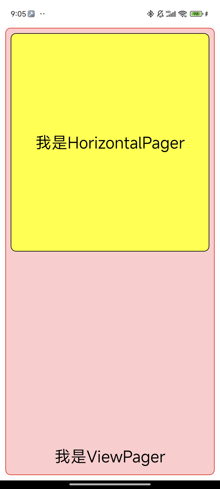
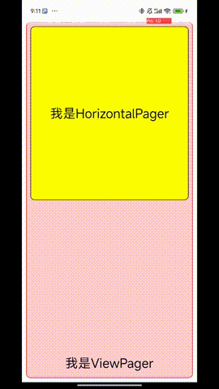

# Compose：ViewPager里面放一个HorizontalPager，结果滑动卡住了？

> ### 本章主题
>
> 定位并解决原生ComposeView与Compose中的HorizontalPager的滑动冲突问题。

> ### 本章核心控件
>
> ViewPager、HorizontalPager(Compose)

在为项目引入Compose的过程中，难免会存在原生组件与Compose组件混合开发的场景，笔者最近在项目中发现了这样一种场景存在滑动问题，并且发现这是`ComposeView`的问题（准确来说是与原生控件的滑动沟通上存在不完善的问题），这个问题类似于早期`ComposeView`不能很好与协调者布局通讯，后面谷歌通过`Modifier`的扩展函数解决了与协调者的通讯问题，但是`ViewPager`与`HorizontalPager`的滑动问题尚未解决，于是本文将为你定位这个问题产生的原因并提供简单的解决方案。


# 1、冲突的产生场景

首先，我们来看一看这个UI以及简单的代码：

<center></center>

最外层的UI是一个`ViewPager`，第一个页是一个纯色背景加一个Compose的HorizontalPager，第二页也是一个纯色背景没什么特别的，这里主要讲`HorizontalPager`和`ViewPager`的问题，因此我们聚焦第一页。

具体问题是什么呢？为了方便读者理解，笔者这里开启了开发者模式的显示滑动轨迹，这样更好看出笔者的操作：

<center></center>

可以看到，当`HorizontalPager`滑动到第二页的时候，用户继续向左滑，理应让`ViewPager`向左滑，因为`HorizontalPager`已经滑到头了，理应让它的父布局继续消费，然而这一切并没有发生。

# 2、问题源码

这里简单提供一下出问题的源码，读者可以使用这些极简源码复刻出一个一样的问题场景：

```kotlin
@Composable
fun Screen(
    modifier: Modifier = Modifier,
) {

    val fragmentActivity = (LocalContext.current as FragmentActivity)

    val viewPagerAdapter = remember(fragmentActivity) {
        object : FragmentStatePagerAdapter(fragmentActivity.supportFragmentManager) {
            override fun getCount(): Int = 2

            override fun getItem(position: Int): Fragment {
                return when (position) {
                    0 -> RedFragment()
                    else -> BlueFragment()
                }
            }

        }
    }


    Box(
        modifier
            .fillMaxSize()
            .statusBarsPadding()
    ) {
        AndroidView(modifier = Modifier.fillMaxSize(), factory = {
            ViewPager(it).apply {
                id = View.generateViewId()
                layoutParams = ViewGroup.LayoutParams(MATCH_PARENT, MATCH_PARENT)
                adapter = viewPagerAdapter
            }
        })
        //...省去文本
    }


}

//此处省略了BlueFragment，因为是一个纯色的View，读者请自行实现


class RedFragment : Fragment() {

    override fun onCreateView(
        inflater: LayoutInflater,
        container: ViewGroup?,
        savedInstanceState: Bundle?,
    ): View {
        return object : AbstractComposeView(inflater.context) {
            
          	//...

            @Composable
            override fun Content() {
                Box(
                    Modifier
                        .padding(10.dp)
                        .fillMaxSize()
                        .clip(RoundedCornerShape(10.dp))
                        .border(1.dp, Color.Red, RoundedCornerShape(10.dp))
                        .background(Color.Red.copy(0.2f))
                ) {
                    val pagerState = rememberPagerState { 2 }
                    Box(contentAlignment = Alignment.Center) {
                        HorizontalPager(
                            modifier = Modifier
                                .padding(10.dp)
                                .clip(RoundedCornerShape(10.dp))
                                .border(
                                    1.dp,
                                    shape = RoundedCornerShape(10.dp),
                                    color = Color.Black
                                ),
                            state = pagerState
                        ) {
                            when (it) {
                                0 -> Box(
                                    Modifier
                                        .fillMaxWidth()
                                        .fillMaxHeight(0.5f)
                                        .background(Color.Yellow)
                                )

                                else -> Box(
                                    Modifier
                                        .fillMaxWidth()
                                        .fillMaxHeight(0.5f)
                                        .background(Color.Magenta)
                                )
                            }
                        }

                        //...省去文本
                    }

                }
            }

        }
    }

}
```

# 3、问题定位

我们重写`ViewPager`，并在`onTouchEvent`中输出日志，可以观察出如下现象：

- 当滑动`HorizontalPager`以外的区域时，`ViewPager`可以收到事件。
- 当滑动`HorizontalPager`时，`ViewPager`无法收到事件。

可以得出结论：

当用户操作`HorizontalPager`的时候，`ComposeView`无论什么情况都把事件消费了，哪怕`HorizontalPager`已经滑动到头了，因此父布局`ViewPager`无法接收到事件，这导致了`ViewPager`不会恰当地滑动。

我们写的可组合函数都是挂载在`AbstractComposeView`中的，而这个View并没有特别地处理内部滑动对外部的影响（实际上也没办法做，具体原因看下文）。

为什么会出现这个问题呢？谷歌为什么没有修复这个问题呢？

其实这属于安卓的历史遗留问题了，在早期的安卓代码中，谷歌并没有为嵌套滑动提供一套运行机制（这是早期安卓系统交互还比较简单的历史阶段），开发者只能自行通过重写各种事件分发方式来解决类似的嵌套滑动问题。

为什么`ComposeView`可以在安卓的协调者布局或者其他NestScroll场景中很好的执行呢？这是因为后来谷歌开发了一套NestScrollParent、NestScrollChild的接口，这让组件的嵌套滑动扩展性极大地增强，开发者可以面向接口编程而不是面向具体的View（这也给许多开发者启发，面向接口而不是面向实例）。

# 4、解决问题

那么知道了问题，该如何解决呢？我们知道了当`HorizontalPager`滑动到尽头后，理应让父控件（即`ViewPager`）接管剩余的滑动事件，那么我们遵循这个思路来写代码即可：

## 4.1、监听HorizontalPager是否滑动到尽头

我们通过阅读源码可以得知，`HorizontalPager`的状态类`PagerState`是继承于`ScrollableState`的，因此它可以获取是否继续向前或者继续向后滑动：

```kotlin
abstract class PagerState(
    val initialPage: Int = 0,
    val initialPageOffsetFraction: Float = 0f
) : ScrollableState {
  //...
}

@JvmDefaultWithCompatibility
interface ScrollableState {
  
  //...
  
  //可以继续向前滑动（即还没有滑动到右侧尽头）
  val canScrollForward: Boolean
        get() = true

  //可以继续向后滑动（即还没有滑动到左侧尽头）
  val canScrollBackward: Boolean
      get() = true
  
}
```

因此我们通过`SnapshotFlow`来实时监听这两个状态，并保存在`AbstractComposeView`中

```kotlin
class RedFragment : Fragment() {

    override fun onCreateView(
        inflater: LayoutInflater,
        container: ViewGroup?,
        savedInstanceState: Bundle?,
    ): View {
        return object : AbstractComposeView(inflater.context) {

            private var canScrollForward = true
            private var canScrollBackward = true

            @Composable
            override fun Content() {
                Box(
                    Modifier
                        //...
                ) {
                    val pagerState = rememberPagerState { 2 }
                    LaunchedEffect(Unit) {
                        launch {
                            snapshotFlow { pagerState.canScrollForward }.collect {
                                canScrollForward = it
                            }
                        }
                        launch {
                            snapshotFlow { pagerState.canScrollBackward }.collect {
                                canScrollBackward = it
                            }
                        }
                    }
                    Box(contentAlignment = Alignment.Center) {
                        HorizontalPager(
                            //...
                            state = pagerState
                        ) {
                            //...
                        }
                    }

                }
            }

        }
    }

}
```

## 4.2、当HorizontalPager不可以滑动的时候，将事件给父布局继续处理

接下来，我们重写`AbstractComposeView`的`dispatchTouchEvent`方法，当向左滑而且右侧到尽头的时候，交给父布局处理，当右滑而且左侧到尽头的时候，也交给父布局进行处理。

```kotlin
object : AbstractComposeView(inflater.context) {

      private var canScrollForward = true
      private var canScrollBackward = true
      private var lastX = 0f
      private var lastY = 0f

      override fun dispatchTouchEvent(ev: MotionEvent): Boolean {
          when (ev.action) {
            	//手指按下的时候记录位置
              MotionEvent.ACTION_DOWN -> {
                  lastX = ev.x
                  lastY = ev.y
              }

              MotionEvent.ACTION_MOVE -> {
                  val dx = ev.x - lastX
                  val dy = ev.y - lastY
                  lastX = ev.x
                  lastY = ev.y

                	//这个比例是为了避免斜滑，从其他地方抄来的，读者请自行斟酌
                  val r = abs(dy) / abs(dx)
                
                	//检测是否滑动到尽头，如果滑动到尽头，则返回false让父布局继续处理
                  val needParentScroll =
                      (dx < 0 && !canScrollForward) || (dx >= 0 && !canScrollBackward)

                	//如果不是斜滑而且需要父控件滚动的情况，返回false表示给父控件处理Event
                  if (r < 0.6f && needParentScroll) {
                      return false
                  }
              }

          }
          return super.dispatchTouchEvent(ev)
      }
}
```

## 4.3、改动结果

<center></center>

可以看到，滑动`HorizontalPager`到尽头的时候继续滑，可以让`ViewPager`继续往下滑

# 5、总结

出现这个问题的原因是Compose的滚动机制和View的滚动机制本质上是两套系统，在默认情况下Compose是无法正常通知其View类型父组件滚动情况的，这就需要开发者手动重写相关的事件传递代码。

类似的问题应该还有`Compose`的`HorizontalScroll`等，因为它们本质上还是走的Scrollable的那套机制，读者结合项目情况自行重写AbstractComposeView的事件传递函数即可。