# 状态保存

## 1、为什么需要状态保存？

说「状态保存」之前，我们先讲一讲为什么需要状态保存：

常见的window、linux系统不同的是，移动端的操作系统拥有的内存更少，因此这类系统更容易面临**内存不足**的情况，如何最大限度利用较少的内存是移动端操作系统比较重要的问题。

对于安卓系统来说，一个`Activity`不可见时，即这时已经跳转到了另外一个`Activity`或者整个App都处于处于后台的情况下，同时它的生命周期处于「Stoped」。在这之后，一旦出现内存不足的情况，Android系统就会考虑销毁这些用户不可见的`Activity`，这样就可以释放它们占用的内存，给予用户目前正在交互的`Activity`更多的内存，避免彻底的OOM（out of momory)异常出现。

此刻就出现了一个问题，如果只是单纯的把`Activity`销毁了，那么之前用户操作的信息就全部丢失了，可以想象的一个场景是：用户正在编辑一段日记的时候，来了一个电话，当通话结束之后（假设此刻处于后台的编辑日记的Activity由于内存不足被销毁了），那么返回到App的时候，用户会发现花了很多时间编辑的日记已经全部丢失，这样的App逻辑是无法接受的。因此我们需要一种机制：在即将被销毁的时候保存`Activity`的状态，页面重建之后根据之前保存的状态恢复页面，这种“机制”就是标题所谓的「状态保存」。

## 2、状态在安卓中意味着什么

在安卓中，当我们提到「状态保存」的时候，开发者保存的状态其实就是某些「成员变量」。

因此，读者可以简单的理解为，当一个变量存在于View中，即此变量为View的成员变量时，此变量可能会由于View的重建而丢失，因为View此时是一个全新的实例。同理，当Activity与Fragment也会存在类似的场景丢失他们的成员变量。因此开发者需要处理这些可能会由于实例的替换导致丢失成员变量的场景，这个处理的过程就是安卓的「状态保存」。

下面结合代码理解一下：

#### 2.1、View的实例状态

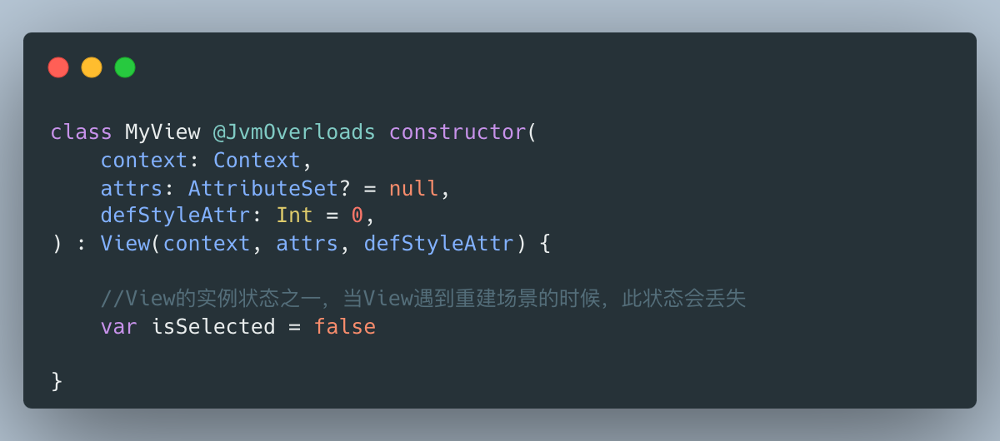

根据上文所述`View`中的那些成员变量就是「View的实例状态」，这里展示一个按钮案例，常见的按钮就有”选中“和”未选中“两个状态，因此开发者会用一个布尔值来存储这个状态，但是由于重建机制的存在，`View`会被一个新的实例代替，那么此时的View就丢失了状态了。

#### 2.2、Activity的实例状态

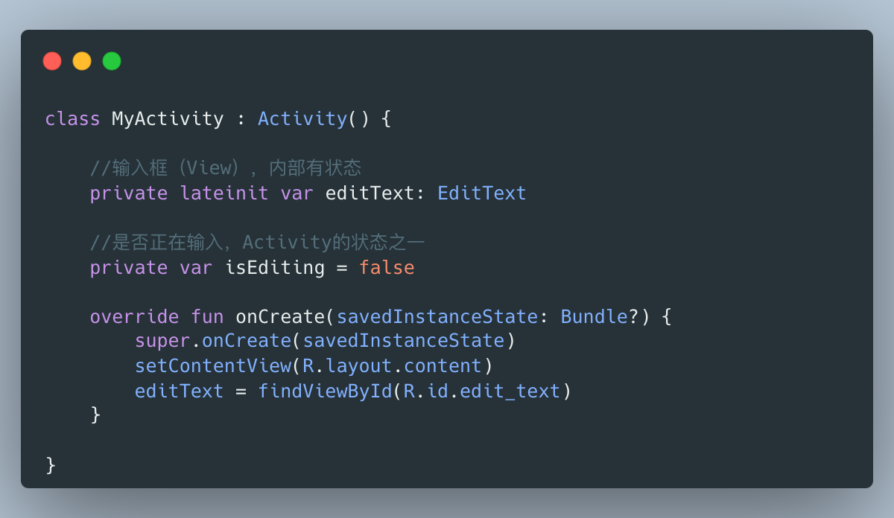

一个`Activity`中存在着`View`，在`View`的内部存在着「View的实例状态」，同时它旁边也存在着一些`Activity`的成员变量，这些成员变量和`View`内部的状态共同组成了「`Activity`的实例状态」。

同样，当遇到重建的场景时，`Activity`会同时丢失自身的状态与`View`内部的实例状态（在`View`没有实现状态保存的情况下）。

#### 2.3、Fragment的实例状态

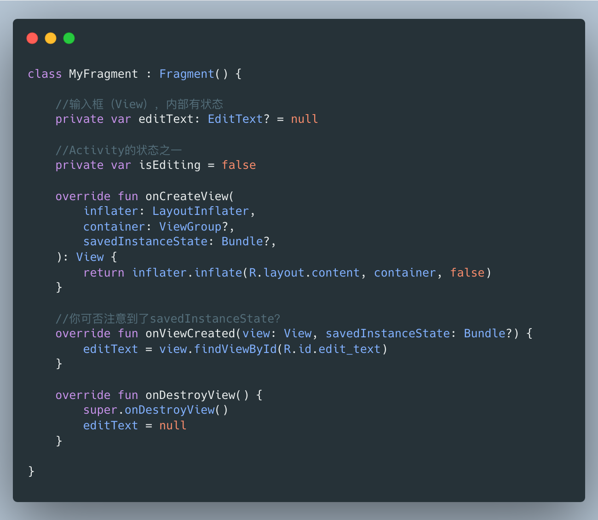

与`Activity`几乎类似，`Fragment`也同样存在着`View`与自身的成员变量，因此「`View`的实例状态」与这些成员变量共同组成了「Fragment的实例状态」。

> 需要注意的是：由于`Fragment`的特殊性，`Fragment`的生命周期与`Fragment`的`View`的生命周期是不一致的，一个`Fragment`在自身的生命周期内可能会跨越多个`View`的重建，这也导致了`Fragment`的状态保存分裂为「成员变量的保存」与「View的实例状态的保存」，这两者在`Activity`中是同时发生的，而`Fragment`中并不一定同时。

#### 2.4、实例状态的包含关系

由于`View`是依附于组件中的，因此「组件的实例状态」除了组件本身的变量，还包括了「`View`的实例状态」，因此当我们说组件的状态保存的时候，其实还包括了保存`View`的状态。

也许读者此时会联想到，`Fragment`也可以存在于父`Fragment`或者父`Activity`，那么它们之间的实例状态也是包含关系吗？

答案是对的，当`Activity`保存自身状态的时候，同时也会让它所包含的`Fragment`保存实例状态。

下面这张图可以展示状态关系：

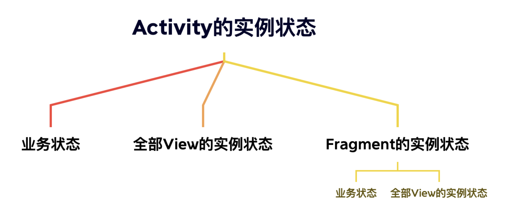

## 3、图示状态保存与恢复

下面援引自[The Real Best Practices to Save](https://inthecheesefactory.com/blog/fragment-state-saving-best-practices/en)的几张图可以很好阐述状态保存时发生的事情：

> 当Activity需要保存实例状态的时候，它会先遍历所有的View让他们各自保存自己的状态，然后打包放在自己的实例状态中的某个地方，和自身的其他业务状态保存在一起。

> 相反，当Activity需要恢复状态的时候，它会从实例状态中找出所有View之前保存的状态，然后将他们恢复给所有的View，同时恢复自身的业务状态。

对于`Fragment`来说整个过程是类似的，这里就不展示了。

## 4、实操状态保存与恢复

### 4.1、View

`View`的状态保存与恢复核心方法是`onSaveInstanceState()`与`onRestoreInstanceState()`。

开发者只需要为当前的`View`在`onSaveInstanceState()`、`onRestoreInstanceState()`中实现图中的操作即可。

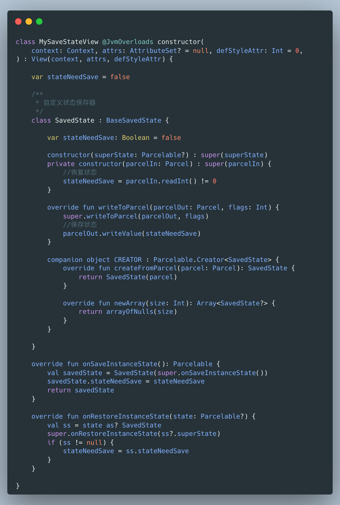

需要注意的是：

> View能够实现状态保存与恢复的前提是：必须在UI树中存在唯一的ID。

换句话说，这要求了开发者必须在布局的xml中为该View赋予唯一的ID，或者动态添加的时候生成一个唯一ID。

这并不难理解，状态保存的本质是将状态缓存在某个容器中，需要恢复的时候从容器中取出来，而ID则是取的Key，如果没有Key那又如何保存状态呢？

### 4.2、Activity

`Activity`的状态保存与`View`类似，也是一对`onSaveInstanceState()`与`onRestoreInstanceState()`方法，但是开发者大多数选择在`onCreate()`中恢复状态，这取决于实际的需要。

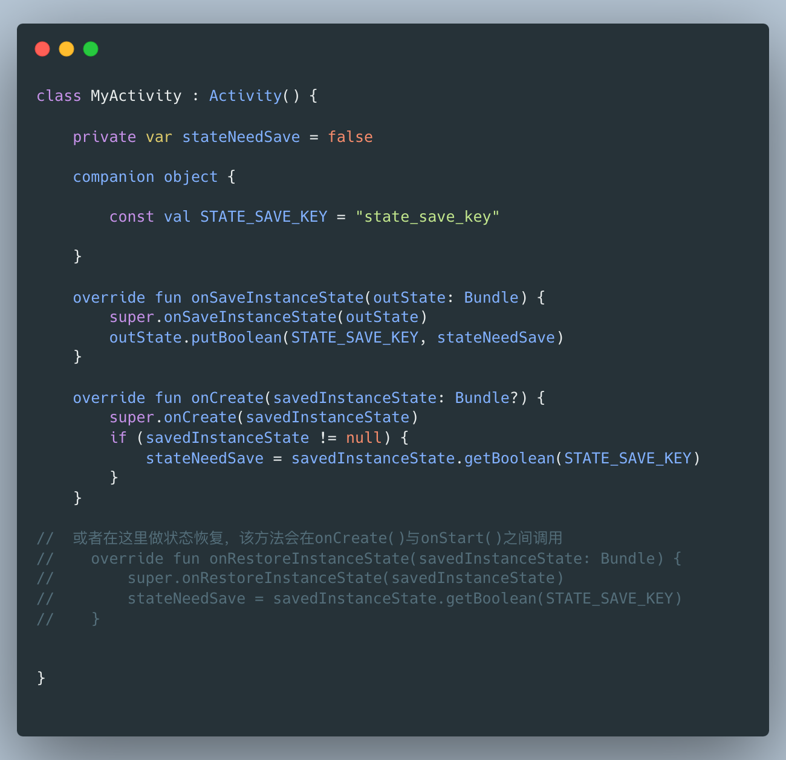

### 4.3、Fragment

`Fragment`的状态保存也与`Activity`类似，下面直接看图即可：

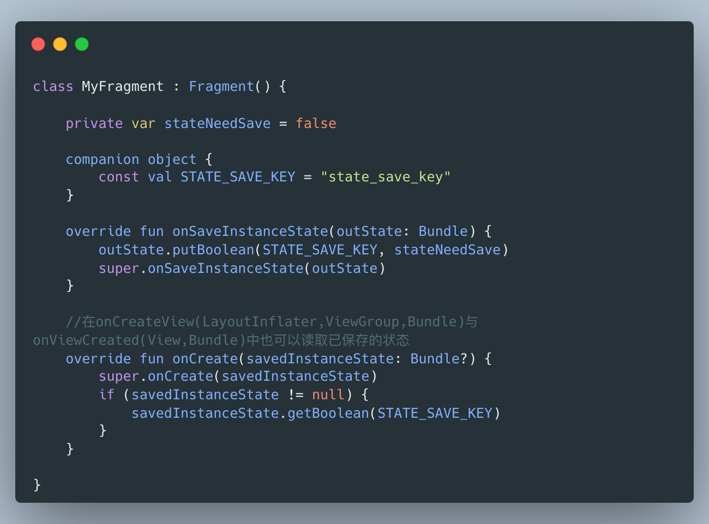

> 依然需要注意的是：在2.3中提到，由于Fragment的实例与UI的分离的设计模式，因此会发生只保存UI状态的情况，因此上图中的onSaveInstanceState()是不会调用的，我们从方法名中也可以看出这是保存实例状态。

## 5、状态保存与恢复的时机？

### 5.1、Activity

> 当`Activity`被意外销毁时，需要保存状态，并在Activity重新恢复显示时恢复状态。

对于`Activity`来说，除了用户手动从当前`Activity`退出以外（这种情况无需状态保存），还有以下两种情况会导致`Activity`会被系统销毁：

> 1. 配置发生变化（用户修改了手机的语言、暗夜模式等）。
> 2. Activity处于「停止」状态时因系统限制（内存不足）而被销毁。
>

为什么用户主动按下返回按钮导致`Activity`销毁不需要状态保存而后两种情况需要状态保存呢？

主要的原因是前者是**「用户意料之内的行为」**，而后两种情况属于**「用户意料之外的行为」**。当一个用户旋转一个页面时，亦或者用户从页面A跳转到B，并稍后从B返回到A时，这两种情况用户并不希望页面的信息丢失了，否则就会出现上文出现的「编辑一半的日记被来电清空」的特殊情况，这对于用户来说是不可以接受的。

下面结合一张图来展示`Activity`生命周期与状态保存的关系：

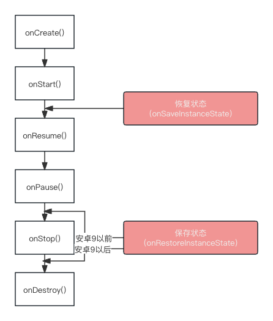

由图中可见，`Activity`的状态保存与恢复发生在`onSaveInstanceState()`和`onRestoreInstanceState()`中，具体的细节下文会解释，这里读者记住它发生的时机即可。（在安卓9之后，保存状态发生在onStop()之后，这与安卓9之前的版本有细微的差异）。

### 5.2、Fragment

> `Fragment`保存状态的时机相对复杂，有好几种情况。同时保存业务状态和保存View的状态的时机并不一定是一致的。

下面援引官方文档的一句结论：

> **注意**：仅当 fragment 的宿主 activity 调用自己的 `onSaveInstanceState(Bundle)` 时，系统才会调用 `onSaveInstanceState(Bundle)`。

实际上这个结论并不能完全概括`Fragment`保存状态的所有时机，只是阐述了其中一种由`Activity`发生状态保存的时候，顺便保存其子`Fragment`状态的情况，而`Fragment`保存状态的情况还有两种，笔者下文会讲，这里先从`Activity`发生状态保存时开始讲起。

#### 5.2.1、Activity状态保存时，顺便保存Fragment的状态，恢复状态同理

这种情况属于自动发生的情况，上文讲`Activity`的状态保存时提到，`Activity`的实例状态其实也包含了`Fragment`的实例状态，因此`Activity`保存状态中也包含了`Fragment`的状态。

通过图示来理解这个过程：

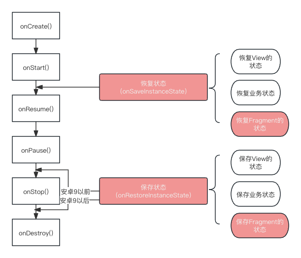

这种情况就是官方文档中提到的「宿主`Activity`」调用`Fragment`的`onSaveInstanceState()`的时候保存状态的情况。

#### 5.2.2、主动保存与恢复Fragment的状态

有时候`Fragment`并不一定要跟随`Activity`进行状态保存，在`Activity`的生命周期期间，其内部的`Fragment`也会主动保存与恢复状态，这暗示着这些`Fragment`存在着需要销毁实例的情况。

下面我们讲讲如何主动保存与恢复这些`Fragment`的状态：

首先我们看FragmentManager(1.5.5版本)的源码，其中存在着一个`saveFragmentInstanceState(Fragment)`的方法，它是public的因此开发者可以使用这个方法「主动保存一个`Fragment`的状态」，随后就可以抛弃掉这个`Fragment`实例。

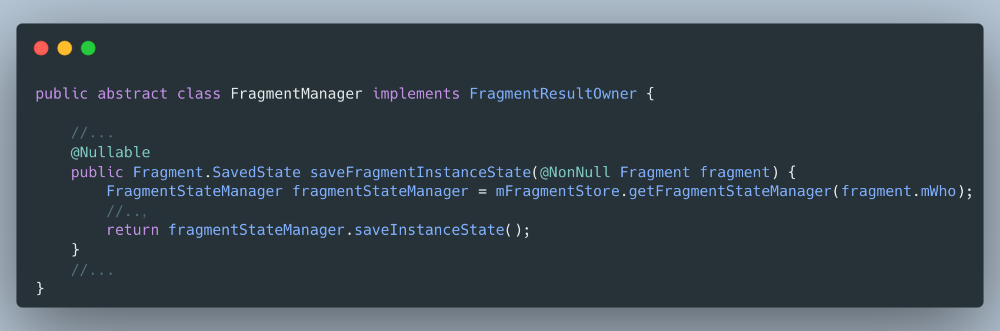

还可以看到，保存的状态为`SavedState`，随后我们可以根据这个状态去为新创建的`Fragment`实例恢复刚才的状态。

那么我们应该如何为新创建的`Fragment`实例恢复呢？`Fragment`专门为这种情况提供了一个方法：

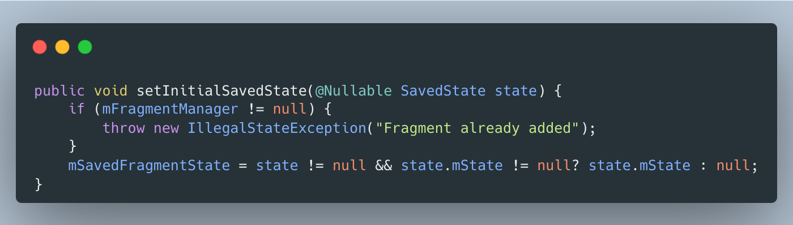

可以看到这个方法单纯就是为了初始化一个`Fragment`的状态，唯一需要注意的是：

> `setInitialSavedState(SavedState)`只能在`Fragment`被`FragmentManager`纳入管理之前调用。

这一对API的意义是什么呢？目的只有一个就是节省内存，因为开发者经常会遇到这种场景：

> `Fragment`暂时不可见，希望回收它的实例但是保存状态，稍后新建一个类型相同的`Fragment`实例，然后用刚才保存的状态将「新建的实例」恢复成「旧的实例」的状态。

如果你熟悉`ViewPager2`，那么你一定了解它的一个`offscreenPageLimit`的机制，`FragmentStateAdapter`这个适配器会将那些离视窗范围太远的`Fragment`销毁掉，这个场景就是上述的提到的。那么它又是如何在重新回到被销毁的`Fragment`的位置的时候将其状态恢复的呢？

答案就是上文提到的主动恢复状态的方法：`setInitialSavedState(SavedState)`。

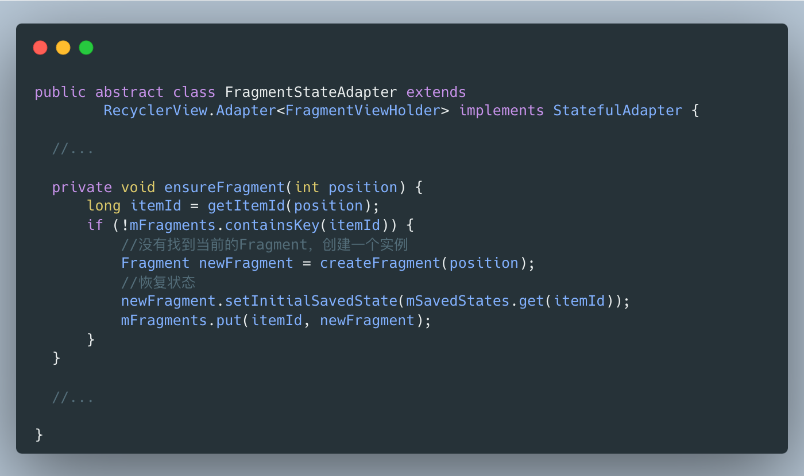

虽然旧的`Fragment`实例被销毁了，但是`ViewPager2`通过保存它的状态的方式，稍后使用了一个新的`Fragment`与之前保存的状态恢复到了当初的样子。

虽然开发者很少会实现自己的「跨Fragment实例的状态保存恢复机制」，但是理解其本质有利于理解`ViewPager`等框架的基础原理。

#### 5.2.3、Fragment进入回退栈的时候

下面引用一段来自[Fragment Lifecycle in Android - GeeksforGeeks](https://www.geeksforgeeks.org/fragment-lifecycle-in-android/)的图阐述一下`Fragment`特殊的生命周期：

在图中可以看出，从`onCreate()`到`onDestroy()`的生命周期中，`Fragment`还可能进入一个从`onCreateView()`到`onDestroyView()`的循环，这个循环的次数可能是大于1次的。

换句话说，在`Fragment`实例被创建到被销毁的期间，它的`View`也许会经历1次或以上的重新创建。

那么什么情况下会发生「只销毁View而不销毁实例」的情况呢？答案如标题所述，就是`Fragment`进入回退栈的时候。

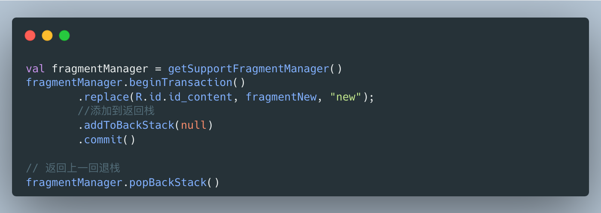

当开发者使用`FragmentManager`执行`replace`操作并调用了`addToBackStack()`的时候，意味着「使用了一个新的`Fragment`替换掉了旧的`Fragment`」，但是这个操作是可逆的，因为操作添加进了回退栈，也就意味着，用户按返回键的时候，会返回到之前那个被替换的`Fragment`。

这意味着，旧的`Fragment`只是暂时被压到了一个栈中，待会仍然可以通过退栈的方式重新回到用户的屏幕中，这个旧的`Fragment`会经历onPause()->onStop()->onDestroyView()的过程，但是仅此而已。它的实例没有被销毁，只是`View`被销毁了而已。

但是开发者仍然不需要担心`View`被销毁后，`View`中的实例状态丢失了，因为`Fragment`考虑到了这种情况，在`FragmentManager`检测到这种场景的时候，会主动让`Fragment`保存其`contentView`的状态并存放在`FragmentManager`中。

然而对于开发者来说，并不需要额外花心思在如何处理`Fragment`的`contentView`的状态如何被保存，因为这个本质是属于`View`层面的东西，了解这个机制的含义更多是解决一些开发中的隐性问题：

> Fragment的实例和UI的生命周期实则是分离的，不能将两者等同，例如不能简单的使用Fragment的生命周期回调对UI进行一些操作而是使用其contentView的生命周期，否则将会发生越界访问（UI销毁了仍尝试访问）或者内存泄漏。
>
> Fragment的UI初始化应该写在onCreateView()中而不是onCreate()，这样能避免在生命周期期间发生UI销毁，导致UI没有被重新初始化等问题。

## 6、古法状态保存的问题

上述分点讨论了`View`、`Activity`、`Fragment`的古法状态保存，不知道读者是否感觉到了他们有一些设计上的缺陷呢？笔者这里总结了几点：

我们以`Activity`为例，回顾一下它的状态保存：

### 6.1、不同类型的状态之间混合在一起

如果我们将一个页面中不同业务的状态，都通过同一种方式（key-value)全部缓存在`onSaveInstanceState(Bundle)`提供的`bundle`中，那么维护起来将十分的复杂。

### 6.2、上层主动保存状态而不是状态持有者本身

另外还要注意的是：`Activity`本质上需要在自身的基础上，通过重写方法的方式来保存和恢复一些状态，然后提供这些状态给别的组件使用。

这样的问题是：状态的使用者往往不是`Activity`而是`Activity`的一些附属的组件，例如一些成员变量、`View`（这里的情况下把`View`的状态上升到了`Activity`来维护，也是开发中常见的一种方式）等。

如果全部的状态都通过`Activity`亲自来维护和恢复，如果后续需要保存的状态多起来的话，将会为`Activity`的开发提高了很大的负担。再者这也是违背单一权责的，单个方法中需要管理的不同业务的状态太多了。

### 6.3、缺乏统一的管理层

Activity、Dialog、Fragment等不同场景均依赖自身的方法，缺乏统一的代码。数据的维护可能需要团队的代码规范。

### 6.4、总结

古法状态保存由于历史的原因，设计的缺陷非常的大，开发者很难在复杂的业务中精准、高效地保存页面状态。

## 7、走向SavedState库

谷歌为了解决上述的状态保存的问题，提出了SavedState库。

让我们看看「SavedState」库的整体脉络：

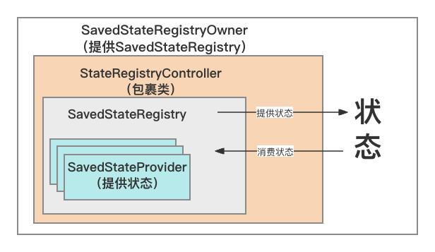

图中可以看出，状态是缓存在`SavedStateRegistry`中的，而该Registry又通过不同的`SavedStateProvider`来保存不同类型的状态，达到了分类管理的效果。

单纯一幅图是没法完全理解这个库的，下面进行分点讲解：

### 7.1、关键类解析

#### 7.1.1、SavedStateRegistryOwner

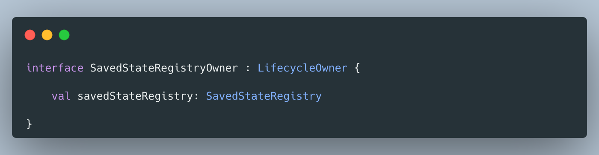

可以看到，`SavedStateRegistryOwner`是一个非常简单的接口，它的目的是对外提供一个`SavedStateRegistry`，这是一个集中管理状态的管理器，下文会提到这里略过。

还需要注意的是，该接口是`LifecycleOwner`的子类，因此它拥有感知生命周期的能力。不难理解，毕竟需要状态保存与恢复需要发生在组件恰当的生命周期中。

#### 7.1.2、SavedStateProvider

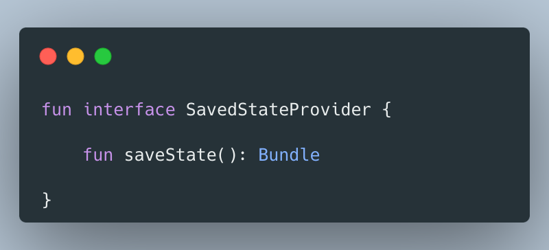

`SavedStateProvider`是一个接口，它的含义是「状态提供器」，实现该接口的类本质上就是定义了如何保存一类状态的方式。当需要保存状态时，`SavedStateRegistry`就会让它管理的所有Provider按定义保存所有状态。

#### 7.1.3、SavedStateRegistry

`SavedStateRegistry`是一个管理器，管理着一系列的`SavedStateProvider`，当其拥有者重建时，Registry也会重新创建一个新的实例。当Registry的拥有者（例如`Activity`）被创建的时候，Registry就会尝试恢复之前保存的状态。

让我们总体概览一下`SavedStateRegistry`的代码， 不用为复杂的代码感到担心，下面会详解：

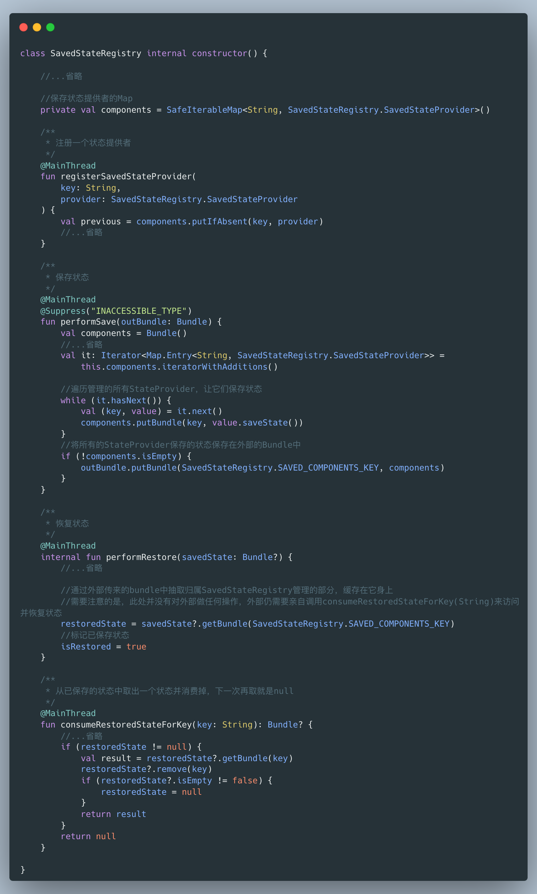

##### 7.1.3.1、注册与反注册「状态提供者」

上文中提到，`SavedStateRegistry`是一个管理一系列`SavedStateProvider`的容器，因此它提供了一对方法用于注册和解绑这些`StateProvider`，稍后这些Provider在保存与恢复状态中起到了关键作用。

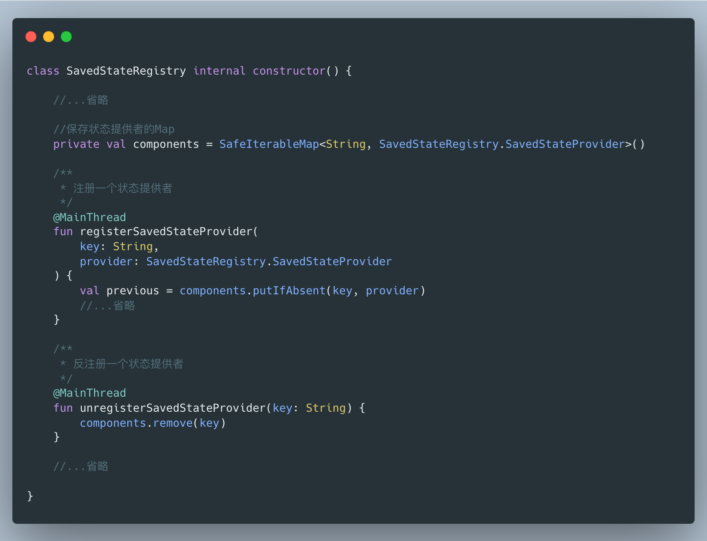

##### 7.1.3.2、恢复与消费状态

`SavedStateRegistry`分别提供了`performRestore(Bundle?)`和`consumeRestoredStateForKey(String?)`来实现状态的恢复与消费。

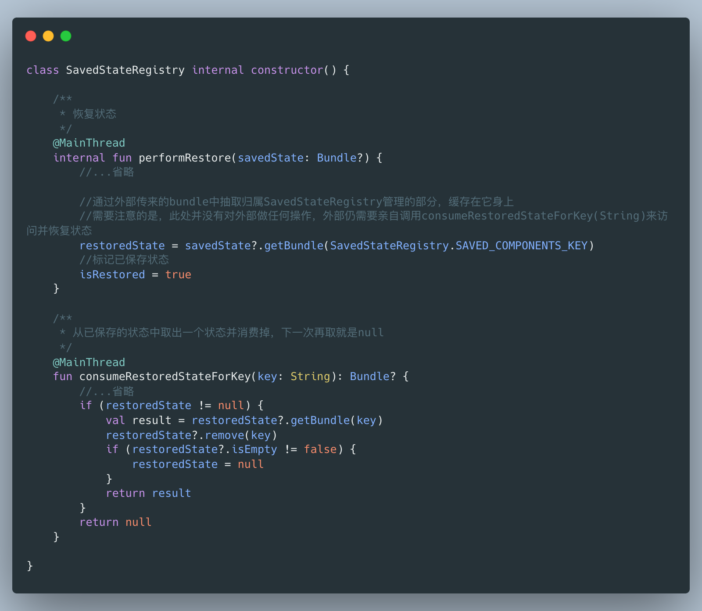

从代码中可见，「恢复状态」只是从外部的Bundle中抓取一部分存放到Registry内部，并没有去执行取值的操作。如果需要从恢复后的状态中取值，则再次多次调用`consumeRestoredStateForKey(String?)`来取状态。

那么为什么「恢复状态」之后还要「消费状态」呢？

这里笔者的结论是：存在「恢复状态后，还不能立即消费状态」的场景。因此谷歌在设计该Api的时候，把状态的消费单独分离出来，适配更多场景。

> 需要注意的是：消费状态必须要在状态保存发生之后，可以使用`SavedStateRegistry.isRestored`来判断，否则会异常。

##### 7.1.3.3、保存状态

保存状态的代码也非常简洁，就是将`SavedStateRegistry`中的所有`SavedStateProvider`集中打包放到外部的bundle中。

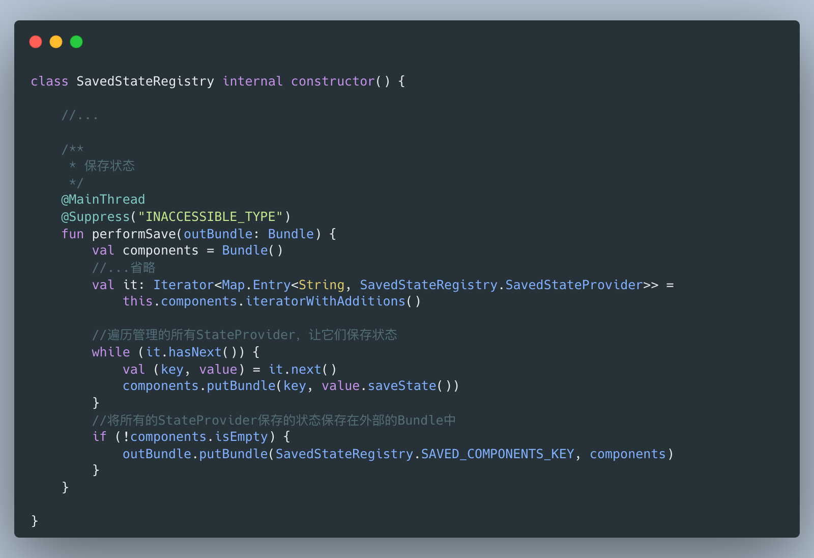

#### 7.1.4、SavedStateRegistryController

这个类并没有什么特殊的，他只是`SavedStateRegistry`之间的包装类，结合`SavedStateRegistryOwner`做了一些生命周期上的工作，本质还是使用`performRestore(Bundle?)`和`performSave(Bundle?)`两个方法与`Registry`进行沟通：

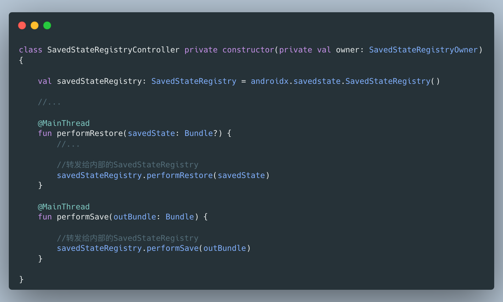

因为Controller多了与生命周期的监听，因此实际开发中，直接使用`SavedStateRegistry`还是比较少的，大多数使用`SavedStateRegistryController`来间接控制。

#### 7.1.5、总结

让我们重新回到这张图中，根据刚才的解析总结一下各组件的功能：

- SavedStateRegistryOwner：`SavedStateRegistry`的提供者。
- StateRegistryController：间接控制`SavedStateRegistry`。
- SavedStateRegistry：状态的管理者。
- SavedStateProvider：状态的提供者。

### 7.3、谷歌眼中的SavedState

我们结合谷歌提供的AndroidX代码来理解一下SavedState库是如何被使用的。

#### 7.3.1、ComponentDialog

在`ComponentDialog`中，存在着SavedState库的核心代码，我们抽取出来看看：

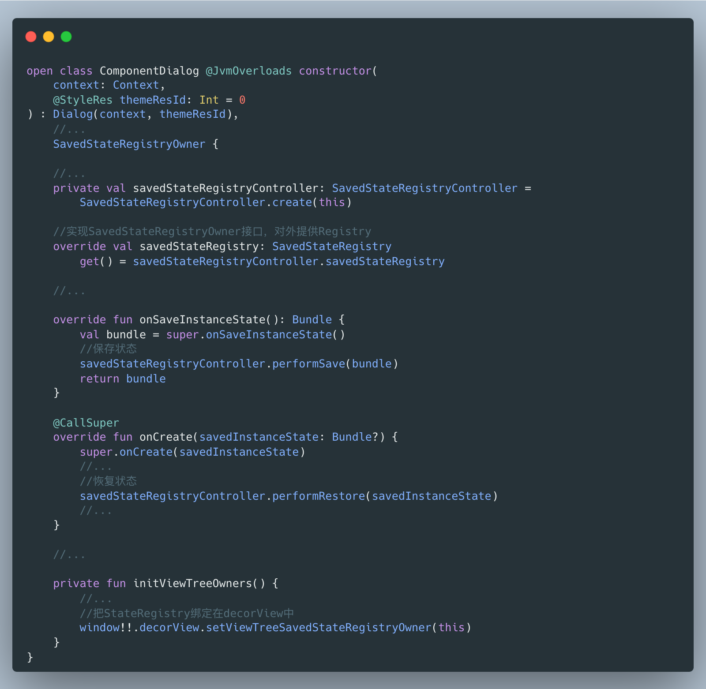

可见，该Dialog实现了`SavedStateRegistryOwner`接口，因此它可以对外提供`SavedStateRegistry`，上文中提到，由于`SavedStateController`包含的能力更多，因此都是直接使用`SavedStateController`来间接操控`SavedStateRegistry`。

在`onSaveInstanceState()`中，使用了Controller来保存状态，而在`onCreate(Bundle?)`方法中，使用了Controller来恢复状态。

还有一点值得注意的是，在`initViewTreeOwners()`方法中，将当前的`SavedStateRegistryOwner`绑定在了`Dialog`所在的`DecorView`中，这样给该`Dialog`下面的所有`View`提供了访问该`Dialog`的`SavedStateRegistry`的能力。

> 关于ViewTreeStateRegistryOwner的设计，在生命周期那一章已经简单阐述过类似的概念，不懂的读者可以回去阅读生命周期章。

#### 7.3.2、ComponentActivity

同时我们再看看`ComponentActivity`，本质上和Dialog也相似，关键代码已经全部截取出来了，读者结合Dialog的代码自行领会即可。

`Fragment`的几乎也一样，这里就不展示了。

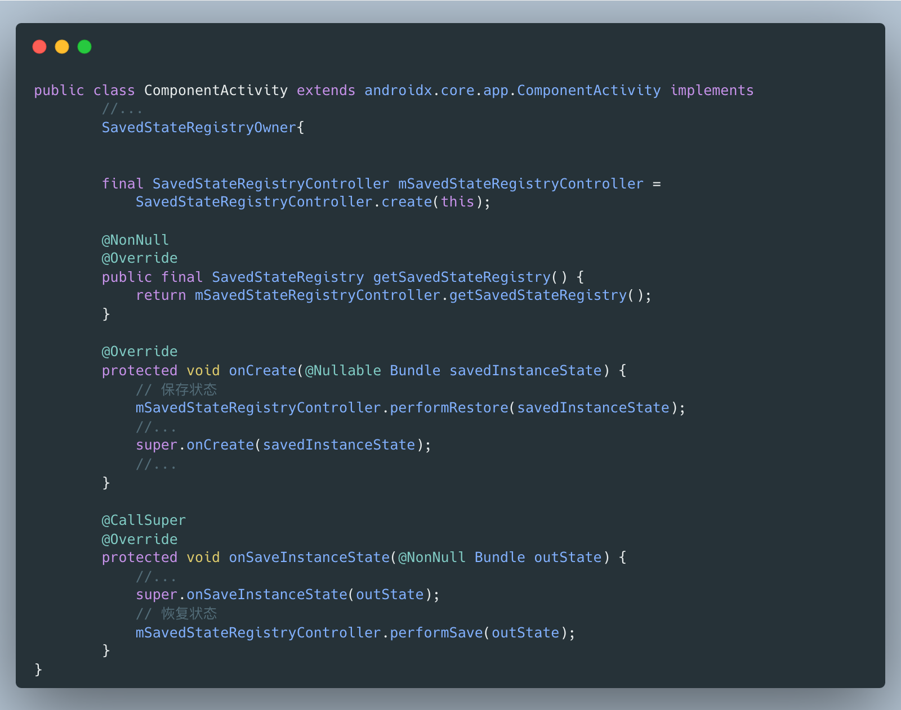

## 8、SavedState的实战——SavedStateHandle

那么开发中如何使用SavedState呢，实际上开发者并不需要在项目中亲自试用SavedState，例如在Activity中直接使用`SavedStateRegistry`，而是配合`ViewModel`与其配套的`SavedStateHandle`一起使用。

为什么会这样呢？因为直接在Activity、Fragment中声明变量已经不适合现代mvvm等开发模式了，而是将状态和逻辑写在`ViewModel`中，而`Activity`、`Fragment`等只做数据的订阅载体。

因此ViewModel就需要一种访问其组件上的缓存的状态的能力，这里就引出本篇文章的主角——`SavedStateHandle`，我们直接先看看它是如何被使用的吧：

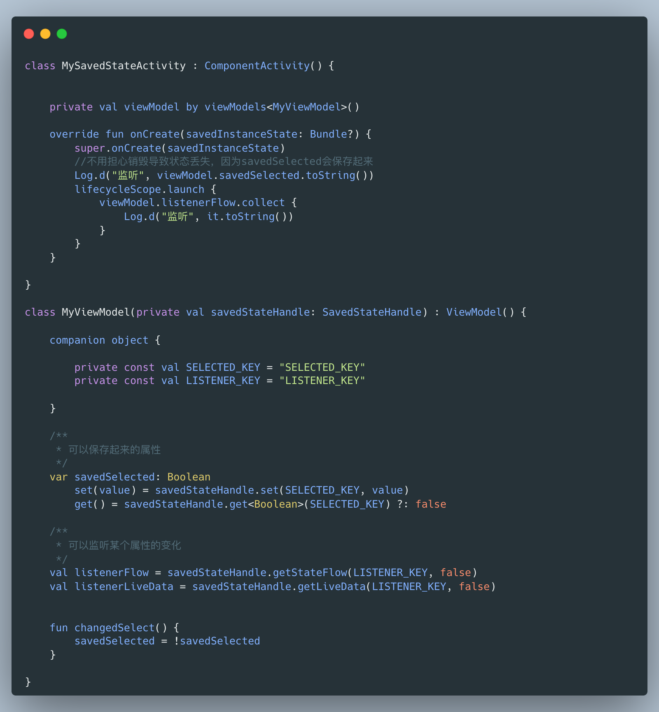

只需要在ViewModel的构造函数中添加`SavedStateHandle`这个参数即可，开发者通过`SavedStateHandle`可以读取到`Activity`的`getIntent()`的值，亦或者是读取到`Fragment`的`getArguments()`的值。相反的，也可以通过`SavedStateHandle`往里面写入值。

这种用法有什么用呢？作用是两点：

1. 读取`Activity`或者`Fragment`的入参。
2. 写入与读取状态，这些状态可以被状态保存机制保存起来。

第一点就不细说了，这个可以让`ViewModel`读取到当前所在组件的入参，做一些逻辑上的初始化工作。

这里重点是第二点，如果你了解`ViewModel`，那么你肯定知道`ViewModel`在配置更新导致的组件重建的时候，是不会销毁的，然而一旦遇到非配置更新导致的重建的情况（例如处于Stoped状态的`Activity`由于内存不足被系统回收），`ViewModel`就会被销毁了。

为了解决`ViewModel`在上述情况被销毁导致状态丢失的问题，开发者可以通过`SavedStateHandle`来写入和读取一些值，这个值会在发生状态保存的时候被写入到组件的Bundle中，并在组件组件重建的时候重新回到`SavedStateHandle`中，这让`ViewModel`拥有了读写状态的能力。

### 8.1、SavedStateHandle如何做到的

也许你一定很好奇`SavedStateHandle`是如何能够与`Activity`或者`Fragment`发生联系的，如果上述关于`ComponentActivity`等代码你还有印象，那么你肯定能猜到：

> `SavedStateHandle`访问了组件的`SavedStateRegistry`，并在上面读取和写了状态。

让我们通过代码来看看`SavedStateHandle`做了什么事：

首先，`ViewModel`的构建都是通过工厂类反射得到的，因此我们使用了一个带参的`ViewModel`，那么必定存在一个对应的工厂类，这个工厂类在SavedState库中已经实现好了：

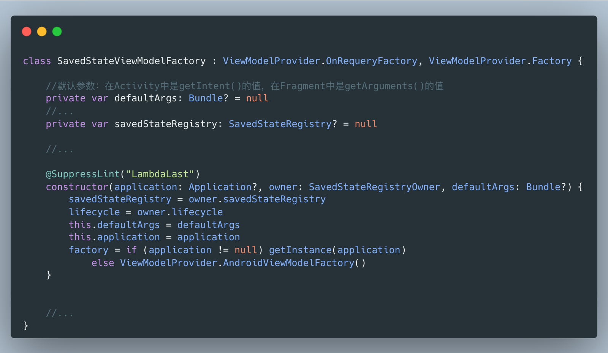

可以看到，这个工厂类在构建方法中允许传入一个外部的`SavedStateRegistryOwner`来获取其`SavedStateRegistry`，同时还传入了一个defaultArgs，还记得上面说的吗？这个参数在`Activity`中是`getIntent().getExtras()`，在`Fragment`中是`getArguments()`。我们直接在`ComponentActivity`的代码中验证下：

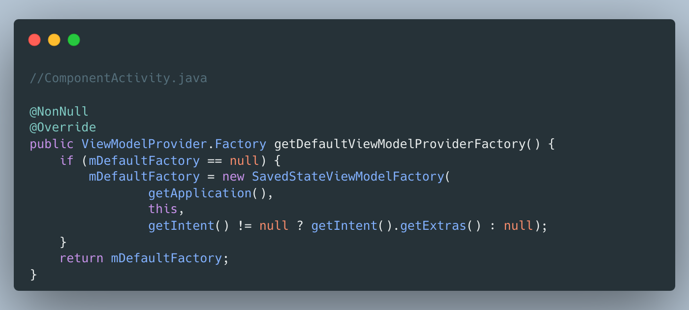

验证成功，关于`Fragment`读者可以亲自验证下，同样是`getDefaultViewModelProviderFactory()`方法。

综上我们可以得出以下结论：

1. `ViewModel`默认可以使用带`SaveStateHandle`的参数的构造函数，因为工厂方法已经默认提供了。
2. `SavedStateHandle`向`ViewModel`提供了读取组件入参、读取写入状态的能力。
3. `SavedStateHandle`的能力的基础源自工厂类拥有组件的`SaveStateRegistry`，因此`SavedStateHandle`被构建时同时也传入了组件的`SaveStateRegistry`。

下面用一张图简单描述一下它们的关系：

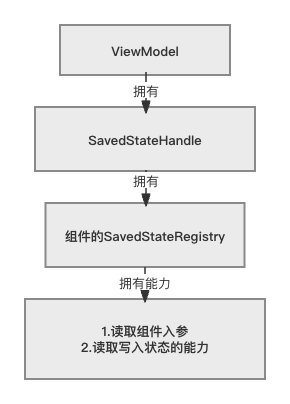

### 8.2、状态保存的思路转变

如果都通过`ViewModel`来保存业务中的状态，那么`View`又如何保存呢，毕竟`View`是没法直接访问`ViewModel`的，其实这陷入了一种思维的误区。

进入MVVM时代之后，开发者更聚焦于状态本身，通过改变状态来让UI自动发生响应，因此`View`本身的状态可以「上升」到`ViewModel`中，组件发生销毁之后，ViewModel仍可以安全的保存状态，因此重新走一遍订阅状态的流程又可以让`View`恢复状态了。

因此，并不是`View`不保存状态了，而是保存的位置迁移到了`ViewModel`。

这里用一张新的图来阐述这种变化：

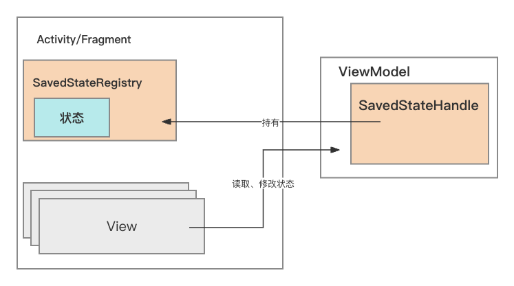

## 9、引入SavedStateHandle后，状态保存的最优解？

上文中提到，在引入MVVM开发思想以及对应的实现工具`ViewModel`之后，我们应该在`ViewModel`中结合`SavedStateHandle`来实现状态保存，但我们需要保存`ViewModel`中所有的属性吗？答案是不必要，这需要从实际业务中出发。

首先需要qing

## 10、总结

本章中，我们从最古早的方法回调的方式了解如何保存与恢复状态，发现出许多旧版方式存在的缺陷，然后从SavedState库着手，以一种新的方式完成状态保存。可以看出近些年来谷歌在努力着手解决安卓整体框架的缺陷。
