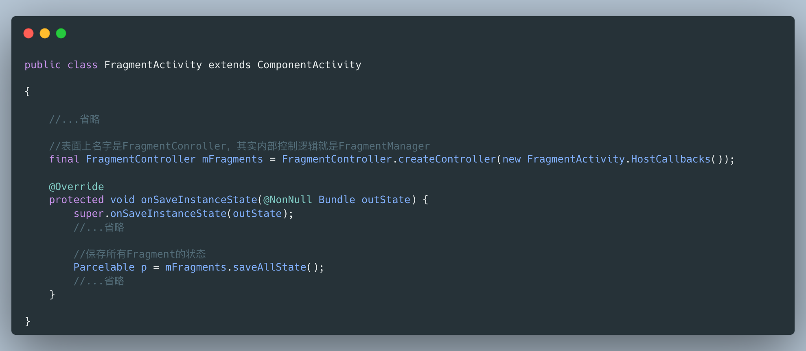
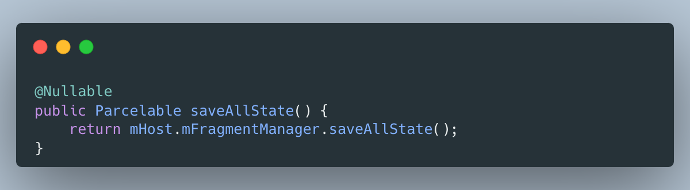

# 状态保存

## 1、为什么需要状态保存？

说「状态保存」之前，我们先讲一讲为什么需要状态保存：

常见的window、linux系统不同的是，移动端的操作系统拥有的内存更少，因此这类系统更容易面临**内存不足**的情况，如何最大限度利用较少的内存是移动端操作系统比较重要的问题。

对于安卓系统来说，一个`Activity`不可见时，即这时已经跳转到了另外一个`Activity`或者整个App都处于处于后台的情况下，同时它的生命周期处于「Stoped」。在这之后，一旦出现内存不足的情况，Android系统就会考虑销毁这些用户不可见的`Activity`，这样就可以释放它们占用的内存，给予用户目前正在交互的`Activity`更多的内存，避免彻底的OOM（out of momory)异常出现。

此刻就出现了一个问题，如果只是单纯的把`Activity`销毁了，那么之前用户操作的信息就全部丢失了，可以想象的一个场景是：用户正在编辑一段日记的时候，来了一个电话，当通话结束之后（假设此刻处于后台的编辑日记的Activity由于内存不足被销毁了），那么返回到App的时候，用户会发现花了很多时间编辑的日记已经全部丢失，这样的App逻辑是无法接受的。因此我们需要一种机制：在即将被销毁的时候保存`Activity`的状态，页面重建之后根据之前保存的状态恢复页面，这种“机制”就是标题所谓的「状态保存」。

## 2、状态在安卓中意味着什么

在安卓中，当我们提到「状态保存」的时候，开发者保存的状态其实就是某些「成员变量」*。

> *并不完全是成员变量，只是对于初学者这样阐述便于理解。

因此，读者可以简单的理解为，当一个变量存在于View中，即此变量为View的成员变量时，此变量可能会由于View的重建而丢失，因为View此时是一个全新的实例。同理，当Activity与Fragment也会存在类似的场景丢失他们的成员变量。因此开发者需要处理这些可能会由于实例的替换导致丢失成员变量的场景，这个处理的过程就是安卓的「状态保存」。

对于层面的不同，我们把状态主要划分为两个层面，一个是「View的实例状态」，一个是「组件的实例状态」，此处提到的组件即`Activity`、`Fragment`。换句话说，当一个变量存在于`View`中时，那么它就是「View的实例状态」，当一个变量存在于组件中时，那么它就是「组件的实例状态」。

**需要注意的是**：由于`View`是依附于组件中的，因此「组件的实例状态」除了组件本身的变量，还包括了「View的实例状态」，因此当我们说组件的状态保存的时候，其实还包括了保存View的状态。

下面结合代码理解一下：

#### 2.1、View的实例状态

根据上文所述`View`中的那些成员变量就是「View的实例状态」，这里展示一个按钮案例，常见的按钮就有”选中“和”未选中“两个状态，因此开发者会用一个布尔值来存储这个状态，但是由于重建机制的存在，`View`会被一个新的实例代替，那么此时的View就丢失了状态了。

#### 2.2、Activity的实例状态

一个`Activity`中存在着`View`，在`View`的内部存在着「View的实例状态」，在`View`的隔壁也存在着一些`Activity`的成员变量，这些成员变量和`View`内部的状态共同组成了「`Activity`的实例状态」。

同样，当遇到重建的场景时，`Activity`会同时丢失自身的状态与`View`内部的实例状态（在`View`没有实现状态保存的情况下）。

#### 2.3、Fragment的实例状态

与`Activity`几乎类似，`Fragment`也同样存在着`View`与自身的成员变量，因此「`View`的实例状态」与这些成员变量共同组成了「Fragment的实例状态」。

> 需要注意的是：由于`Fragment`的特殊性，`Fragment`的生命周期与`Fragment`的`View`的生命周期是不一致的，一个`Fragment`在自身的生命周期内可能会跨越多个`View`的重建，这也导致了`Fragment`的状态保存分裂为「成员变量的保存」与「View的实例状态的保存」，这两者在`Activity`中是同时发生的，而`Fragment`中并不一定同时。

#### 2.4、实例状态的包含关系

也许读者此时会联想到，`Fragment`也可以存在于父`Fragment`或者父`Activity`，那么它们之间的实例状态也是包含关系吗？

答案是对的，当`Activity`保存自身状态的时候，同时也会让它所包含的`Fragment`保存实例状态。

## 3、图示状态保存与恢复

下面援引自[The Real Best Practices to Save](https://inthecheesefactory.com/blog/fragment-state-saving-best-practices/en)的几张图可以很好阐述状态保存时发生的事情：

> 当Activity需要保存实例状态的时候，它会先遍历所有的View让他们各自保存自己的状态，然后打包放在自己的实例状态中的某个地方，和自身的其他业务状态保存在一起。

> 相反，当Activity需要恢复状态的时候，它会从实例状态中找出所有View之前保存的状态，然后将他们恢复给所有的View，同时恢复自身的业务状态。

对于`Fragment`来说整个过程是类似的，这里就不复述了。

## 4、什么时候保存状态？什么时候恢复？

### 4.1、Activity

对于`Activity`来说，除了用户手动从当前`Activity`退出以外（这种情况无需状态保存），还有以下两种情况会导致`Activity`会被系统销毁：

1. 配置发生变化。
2. Activity处于「停止」状态时因系统限制（内存不足）而被销毁。

> 「配置发生变化」指的是用户修改了手机的语言、暗夜模式之类的配置。

- 问：为什么用户主动按下返回按钮导致`Activity`销毁不需要状态保存而后两种情况需要状态保存呢？

- 答：主要的原因是前者是「用户意料之内的行为」，而后两种情况属于「用户意料之外的行为」。

可以想象到的是，当一个用户旋转一个页面时，亦或者用户从页面A跳转到B，并稍后从B返回到A时，这两种情况用户并不希望页面的信息丢失了，否则就会出现上文出现的「编辑一半的日记被来电清空」的特殊情况，这对于用户来说是不可以接受的。

### 4.2、Fragment

对于`Fragment`来说，合适才会保存状态呢？下面援引官方文档的一句结论：

> **注意**：仅当 fragment 的宿主 activity 调用自己的 `onSaveInstanceState(Bundle)` 时，系统才会调用 `onSaveInstanceState(Bundle)`。

对于绝大多数（几乎所有）的安卓项目来说，使用的`Activity`均是其子类`FragmentActivity`，对于该子类来说，均是使用`FragmentManager`来管理`Fragment`，状态管理当然也是由该类完成，因此所谓的「宿主Activity调用自己的 `onSaveInstanceState(Bundle)` 」其实就是宿主使用了`FragmentManger`来保存`Fragment`的状态。

由于`Fragment`合适保存状态的情况有点复杂，下面分几点展开说说。

#### 4.2.1、Activity状态保存时，顺便保存Fragment的状态

上文中提到，绝大多数安卓项目都是使用`FragmentActivity`，因此我们直接以此类研究：

> 注意：案例中的`FragmentActivity`为1.1.0版本，仅作为学习研究原理用，并不代表项目中常用的更高级的版本，因为更高级的版本使用了更为先进的Registry设计模式，后续我们再讲。

在`FragmentActivity`的触发状态保存时，我们看到这样一行代码：

别被`FragmentController`的名字吓到了，其实它内部就是上文提到的`FragmentManger`，不信的话我们看看**mFragments.saveAllState()**的代码：

#### 4.2.2、在恰当的情况主动保存Fragment的状态

很多开发者在整个职业生涯中都写过手动保存`Fragment`状态的代码，这是因为开发者使用的官方组件例如`ViewPager`已经帮开发者实现了状态保存的功能。

如果你对如何手动保存`Fragment`状态感兴趣，可以阅读一下这篇文章，文章结尾处提供了一个手动保存状态的案例：

[Saving Fragment State Yourself. A common complaint from Android… | by Bryan Herbst | Medium](https://medium.com/@bherbst/saving-fragment-state-yourself-522c3bca78c7)