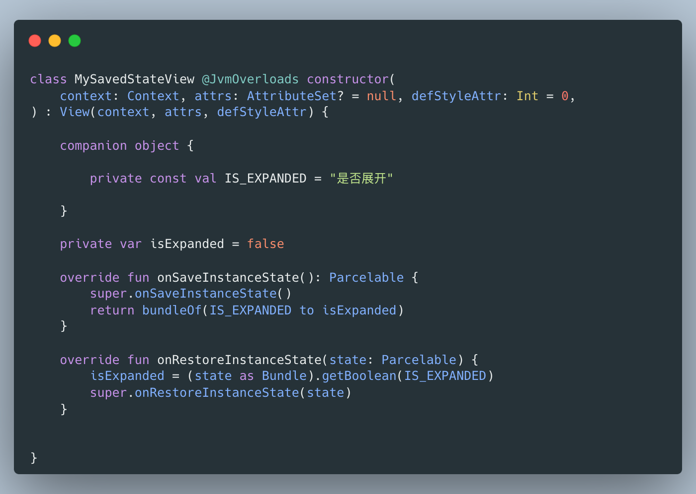

# 状态保存

## 1、为什么需要状态保存？

说「状态保存」之前，我们先讲一讲为什么需要状态保存：

常见的window、linux系统不同的是，移动端的操作系统拥有的内存更少，因此这类系统更容易面临**内存不足**的情况，如何最大限度利用较少的内存是移动端操作系统比较重要的问题。

对于安卓系统来说，一个`Activity`不可见时，即这时已经跳转到了另外一个`Activity`或者整个App都处于处于后台的情况下，同时它的生命周期处于「Stoped」。在这之后，一旦出现内存不足的情况，Android系统就会考虑销毁这些用户不可见的`Activity`，这样就可以释放它们占用的内存，给予用户目前正在交互的`Activity`更多的内存，避免彻底的OOM（out of momory)异常出现。

此刻就出现了一个问题，如果只是单纯的把`Activity`销毁了，那么之前用户操作的信息就全部丢失了，可以想象的一个场景是：用户正在编辑一段日记的时候，来了一个电话，当通话结束之后（假设此刻处于后台的编辑日记的Activity由于内存不足被销毁了），那么返回到App的时候，用户会发现花了很多时间编辑的日记已经全部丢失，这样的App逻辑是无法接受的。因此我们需要一种机制：在即将被销毁的时候保存`Activity`的状态，页面重建之后根据之前保存的状态恢复页面，这种“机制”就是标题所谓的「状态保存」。

## 2、状态在安卓中意味着什么

在安卓中，当我们提到「状态保存」的时候，开发者保存的状态其实就是某些「成员变量」。

因此，读者可以简单的理解为，当一个变量存在于View中，即此变量为View的成员变量时，此变量可能会由于View的重建而丢失，因为View此时是一个全新的实例。同理，当Activity与Fragment也会存在类似的场景丢失他们的成员变量。因此开发者需要处理这些可能会由于实例的替换导致丢失成员变量的场景，这个处理的过程就是安卓的「状态保存」。

下面结合代码理解一下：

#### 2.1、View的实例状态

根据上文所述`View`中的那些成员变量就是「View的实例状态」，这里展示一个按钮案例，常见的按钮就有”选中“和”未选中“两个状态，因此开发者会用一个布尔值来存储这个状态，但是由于重建机制的存在，`View`会被一个新的实例代替，那么此时的View就丢失了状态了。

#### 2.2、Activity的实例状态

一个`Activity`中存在着`View`，在`View`的内部存在着「View的实例状态」，同时它旁边也存在着一些`Activity`的成员变量，这些成员变量和`View`内部的状态共同组成了「`Activity`的实例状态」。

同样，当遇到重建的场景时，`Activity`会同时丢失自身的状态与`View`内部的实例状态（在`View`没有实现状态保存的情况下）。

#### 2.3、Fragment的实例状态

与`Activity`几乎类似，`Fragment`也同样存在着`View`与自身的成员变量，因此「`View`的实例状态」与这些成员变量共同组成了「Fragment的实例状态」。

> 需要注意的是：由于`Fragment`的特殊性，`Fragment`的生命周期与`Fragment`的`View`的生命周期是不一致的，一个`Fragment`在自身的生命周期内可能会跨越多个`View`的重建，这也导致了`Fragment`的状态保存分裂为「成员变量的保存」与「View的实例状态的保存」，这两者在`Activity`中是同时发生的，而`Fragment`中并不一定同时。

#### 2.4、实例状态的包含关系

由于`View`是依附于组件中的，因此「组件的实例状态」除了组件本身的变量，还包括了「`View`的实例状态」，因此当我们说组件的状态保存的时候，其实还包括了保存`View`的状态。

也许读者此时会联想到，`Fragment`也可以存在于父`Fragment`或者父`Activity`，那么它们之间的实例状态也是包含关系吗？

答案是对的，当`Activity`保存自身状态的时候，同时也会让它所包含的`Fragment`保存实例状态。

下面这张图可以展示状态关系：

## 3、图示状态保存与恢复

下面援引自[The Real Best Practices to Save](https://inthecheesefactory.com/blog/fragment-state-saving-best-practices/en)的几张图可以很好阐述状态保存时发生的事情：

> 当Activity需要保存实例状态的时候，它会先遍历所有的View让他们各自保存自己的状态，然后打包放在自己的实例状态中的某个地方，和自身的其他业务状态保存在一起。

> 相反，当Activity需要恢复状态的时候，它会从实例状态中找出所有View之前保存的状态，然后将他们恢复给所有的View，同时恢复自身的业务状态。

对于`Fragment`来说整个过程是类似的，这里就不展示了。

## 4、实操状态保存与恢复

### 4.1、View

`View`的状态保存与恢复核心方法是`onSaveInstanceState()`与`onRestoreInstanceState()`。

开发者只需要为当前的`View`实现一个状态保存器即可，重写`BaseSavedState`并在`onSaveInstanceState()`、`onRestoreInstanceState()`中实现图中的操作即可。

需要注意的是：

> View能够实现状态保存与恢复的前提是：必须在UI树中存在唯一的ID。

换句话说，这要求了开发者必须在布局的xml中为该View赋予唯一的ID，或者动态添加的时候生成一个唯一ID。

这并不难理解，状态保存的本质是将状态缓存在某个容器中，需要恢复的时候从容器中取出来，而ID则是取的Key，如果没有Key那又如何保存状态呢？

### 4.2、Activity

`Activity`的状态保存与`View`类似，也是一对`onSaveInstanceState()`与`onRestoreInstanceState()`方法，但是开发者大多数选择在`onCreate()`中恢复状态，这取决于实际的需要。

不同的是，在`Activity`中开发者更多的是为每一个需要保存的属性定义一个Key，然后根据Key来恢复。

当然在状态较多的情况下，开发者依然可以参考`View`的机制，将属性打包成一个`Parcel`来进行统一保存和恢复，避免定义较多的Key。

### 4.3、Fragment

`Fragment`的状态保存与`Activity`类似，下面直接看图即可：

> 依然需要注意的是：在2.3中提到，由于Fragment的实例与UI的分离的设计模式，因此会发生只保存UI状态的情况，因此上图中的onSaveInstanceState()是不会调用的，我们从方法名中也可以看出这是保存实例状态。

## 5、状态保存与恢复的时机？

### 5.1、Activity

> 当`Activity`被意外销毁时，需要保存状态，并在Activity重新恢复显示时恢复状态。

对于`Activity`来说，除了用户手动从当前`Activity`退出以外（这种情况无需状态保存），还有以下两种情况会导致`Activity`会被系统销毁：

> 1. 配置发生变化（用户修改了手机的语言、暗夜模式等）。
> 2. Activity处于「停止」状态时因系统限制（内存不足）而被销毁。
>

为什么用户主动按下返回按钮导致`Activity`销毁不需要状态保存而后两种情况需要状态保存呢？

主要的原因是前者是**「用户意料之内的行为」**，而后两种情况属于**「用户意料之外的行为」**。当一个用户旋转一个页面时，亦或者用户从页面A跳转到B，并稍后从B返回到A时，这两种情况用户并不希望页面的信息丢失了，否则就会出现上文出现的「编辑一半的日记被来电清空」的特殊情况，这对于用户来说是不可以接受的。

下面结合一张图来展示`Activity`生命周期与状态保存的关系：

由图中可见，`Activity`的状态保存与恢复发生在`onSaveInstanceState()`和`onRestoreInstanceState()`中，具体的细节下文会解释，这里读者记住它发生的时机即可。（在安卓9之后，保存状态发生在onStop()之后，这与安卓9之前的版本有细微的差异）。

### 5.2、Fragment

> `Fragment`保存状态的时机相对复杂，有好几种情况。同时保存业务状态和保存View的状态的时机并不一定是一致的。

下面援引官方文档的一句结论：

> **注意**：仅当 fragment 的宿主 activity 调用自己的 `onSaveInstanceState(Bundle)` 时，系统才会调用 `onSaveInstanceState(Bundle)`。

实际上这个结论并不能完全概括`Fragment`保存状态的所有时机，只是阐述了其中一种由`Activity`发生状态保存的时候，顺便保存其子`Fragment`状态的情况，而`Fragment`保存状态的情况还有两种，笔者下文会讲，这里先从`Activity`发生状态保存时开始讲起。

#### 4.2.1、Activity状态保存时，顺便保存Fragment的状态，恢复状态同理

这种情况属于自动发生的情况，上文讲`Activity`的状态保存时提到，`Activity`的实例状态其实也包含了`Fragment`的实例状态，因此`Activity`保存状态中也包含了`Fragment`的状态。

通过图示来理解这个过程：

这种情况就是官方文档中提到的「宿主`Activity`」调用`Fragment`的`onSaveInstanceState()`的时候保存状态的情况。

#### 4.2.2、主动保存与恢复Fragment的状态

有时候`Fragment`并不一定要跟随`Activity`进行状态保存，在`Activity`的生命周期期间，其内部的`Fragment`也会主动保存与恢复状态，这暗示着这些`Fragment`存在着需要销毁实例的情况。

下面我们讲讲如何主动保存与恢复这些`Fragment`的状态：

首先我们看FragmentManager(1.5版本)的源码，其中存在着一个`saveFragmentInstanceState(Fragment)`的方法，它是public的因此开发者可以使用这个方法主动保存一个`Fragment`的状态，随后抛弃掉这个`Fragment`实例。

还可以看到，保存的状态为`SavedState`，随后我们可以根据这个状态去为新创建的`Fragment`实例恢复刚才的状态。

那么我们应该如何为新创建的`Fragment`实例恢复呢？`Fragment`专门为这种情况提供了一个方法：

虽然开发者可以主动保存与恢复`Fragment`的状态，但很多情况下开发者并不会主动做这件事，因为平时使用的组件例如`ViewPager`等已经基于该机制实现了状态保存，需要了解的一点是，`ViewPager`这一类组件中如果开发者设置了离屏缓存的话，在页面切换的过程中会发生`Fragment`的销毁，但是开发者仍然可以利用状态保存与恢复的机制恢复`Fragment`，背后的原理就是`ViewPager`利用`Fragment`的主动保存与恢复状态的机制帮开发者实现了这一块的功能。

#### 4.2.3、Fragment进入回退栈的时候

