# 生命周期的前世今生

## 1.1、前世——初识篇

天地初开，一切皆为混沌的时代，安卓宇宙中诞生了名为`Activity`（活动）的组件，`Activity`
是Android应用中最关键的组件，一个`Activity`
通常对应的是App的一个页面，当手机使用者在不同的页面之间导航的时候，新的`Activity`
会诞生，同时也会在特定的时候销毁。一个页面的诞生之初到它销毁的这段时间，名为「生命周期」。

理解并掌握生命周期是每一个Android修炼者的必修功力，因为生命周期的每一个阶段均代表`Activity`
处于不同的状态之中，一旦错误处理生命周期周期，修炼者轻则内伤残疾（手机耗电过多，丢失信息），重则走火入魔（程序崩溃）。

关于生命周期，江湖中一直流传着一张「Activity生命周期总览图」，但个中奥秘，却鲜为人知，因此少有人能够修炼到最高境界：

由图可见，`Activity`的生命周期中，提供了6种回调：`onCreate()`、`onStart()`、`onResume()`、`onPause()`、`onStop()`、`onDestroy()`
，需要特别注意的是，这**仅仅**是一种回调，与我们通常的认识不同都是，生命周期的某个阶段是指一个**时间段**
，而回调或者说事件只是一个瞬间，换句话来说，onCreate并不是指生命周期中存在一个阶段名为onCreate，而是`Activity`
触发了onCreate事件，即将进入已创建阶段。

然而可惜的是，在远古Android的设计中，Android的创世神并没有为开发者提供具体的生命周期阶段的概念，仅仅是提供了进入某个生命周期阶段的回调，因此上述提到的“**已创建**”这个状态在原生安卓的概念中并不存在。然而在后人的努力中，生命周期阶段这一概念最终得到确定与落实，不过这都是后话了。

## 1.2、前世——详解篇

### 1.2.1、onCreate()、onDestroy()

- **onCreate()**：`Activity`
  生命周期的起点，首次被系统创建时触发，整个生命周期只会触发一次。此回调通常用于执行页面View的设置，例如`setContentView()`。

- **onDestroy()**：`Activity`生命周期的终点，在`Activity`被销毁前触发，此回调的有两种情况被调用：

1. 用户手动关闭`Activity`（按返回键）或者系统主动关闭`Activity`（一般是App进程因内存不足被销毁，导致`Activity`也被销毁）。
2. 配置变更（设备旋转、语言切换等）。

简单来说，onCreate()是`Activity`被创建的时刻，onDestroy()是`Activity`即将被销毁的时刻。

一个`Activity`进入onDestroy()
之后，理应被GC回收，但是如果此时它仍然被引用（例如被某些网络请求的回调中被引用），那么此`Activity`就会导致**内存泄漏**
，这也是所有Android开发者需要关注其生命周期的原因。

### 1.2.2、onStart()、onStop()

- **onStart()**：当`Activity`在onCreate()之后不久就会触发此回调，说明了`Activity`
  此刻进入了“已开始”的状态，但是此刻的`Activity`仍然**未获取焦点**。

很多Android开发者一直搞不懂Activity为什么会存在一个**可见但是没有获取焦点**的状态，会存在这种疑惑的原因是因为Android通常作为**一种移动设备的系统而存在**，而移动设备由于其特殊性，通常也只会同屏存在一个页面，因此**可见但是没有获取焦点**这种状态几乎只存在一瞬间（它马上就会遮住之前正在交互的页面），然而我们以电脑系统的角度来看，电脑系统的桌面上基本都是多窗口并存的，然而即使存在了多窗口，用户能交互的也仅仅只有获取焦点的那个窗口。

因此，**可见但是没有获取焦点**的窗口，就像是电脑上那些打开着、但被用户正在交互的窗口挡住的那些窗口，假如电脑桌面上存在着一个QQ窗口，然而用户正在编写一个Word文档，那么被Word挡住的那个QQ窗口，就是**可见但未获取焦点**的窗口。

- **onStop()**：当一个`Activity`从**可见但是没有获取到焦点**的状态变为**完全不可见**的状态时就会触发此回调，按照上文类比，这种情况通常可以理解为：**电脑桌面上的一个被遮挡的窗口被最小化了**。

### 1.2.3、onResume()、onPause()

- **onResume()**：当`Activity`从**可见但是没有获取焦点**的状态变成**可见同时获取焦点**的状态时，触发此回调，同样按照电脑系统的角度来理解，这种情况通常可以理解为：**电脑桌面上的一个被遮挡的窗口此刻被用户交互了**。
  
- **onPause()**：当`Activity`从“**可见同时获取焦点**”的状态变成**可见但是没有获取焦点**的状态时，触发此回调，同样同样按照电脑系统的角度来理解，这种情况通常可以理解为：**电脑桌面上的一个正在被用户交互的窗口，由于用户操作了其他窗口，导致当前的窗口被遮挡了，也因此失去了焦点**。

## 1.3、前世——总结篇

我们从电脑系统的窗口去理解`Activity`的生命周期：

1. 启动一个程序的时候，程序就会在电脑桌面上创建一个窗口，创建的那一瞬间（通常会很快，可能不需要1秒）就相当于`Activity`的onCreate()。
2. 创建完成后，窗口就可以被用户所看见了，被用户看到的那一瞬间就相当于`Activity`的onStart()。
3. 通常来说，一个新启动的程序会自动获得焦点并可被用户交互，因此onStart()之后，窗口会被置顶到顶层，这一瞬间就相当于`Activity`的onResume()。
4. 当用户选择其他窗口时，之前交互的窗口并不会消失，而是会失去焦点并被用户最新交互的窗口所遮挡，这一瞬间就相当于`Activity`的onPause()。
5. 当用户最小化窗口时，窗口就会进入后台（并不是销毁）而且并不能被用户所看见，这一瞬间就相当于进入了`Activity`的onStop()。
6. 当用户关闭程序亦或者电脑内存不足时，程序被销毁，窗口同时也被销毁了，这一瞬间就相当于进入了`Activity`的onDestroy()。

一个窗口当然可以失去焦点后重新获取焦点，因此onPause()和onResume()可能在生命周期中多次被执行，同理窗口也可以最小化之后重新最大化，onStart()和onStop()也可能在生命周期中多次被执行。只不过对于移动设备来说，几乎不存在页面失去焦点后又重新获得焦点的情况，因为移动设备的页面绝大多数情况都是一个页面可被用户交互，被挡住的页面完全不可见，即等价于电脑系统中只存在一个最大化的页面，所以移动设备的`Activity`的生命周期通常只会在onStart()和onStop()两者之间流转（当然，仍然会遵循onStart()->onResumt()->onPause()->onStop()的顺序）。

而一个窗口只能被创建和销毁一次，因此在`Activity`的生命周期中，onCreate()和onDestroy()只会被调用一次。

> 上文中提到，原生的Android生命周期设计中，只提供了进入某个生命周期状态的回调，并没有提供具体的状态的定义，例如onCreate()
> 与onStart()之间的状态叫什么呢，官方的文档提到了这个叫“已创建”的状态，然而这只存在于文本性的文档中，这在代码中并不存在，只能作为一种“共识”的定义。这也为开发者之间沟通生命周期带来了极大的困扰。

## 2.1、今生——初识篇

经历漫长的混沌时代之后，Jetpack携带着「Lifecycle」正式进入到了Android的世界中，「Lifecycle」为千千万万的Android修炼者带来了福音，因为它比起传统的基于回调的方式来感知生命周期的方式有以下的优点：

1. **提出了「生命周期状态」的概念，弥补了安卓传统的生命周期只有事件没有状态的缺陷**
2. **将生命周期管理从页面（如Activity和Fragment）脱离，将生命周期监听的职责转移到组件中，降低页面与组件的耦合度。**

为了让读者更加清晰使用「Lifecycle」与不使用它之间的区别，这里使用两个代码案例来对比：

- 首先，定义一个常见的基于回调的监听类，每秒钟会对外广播一次字符串。

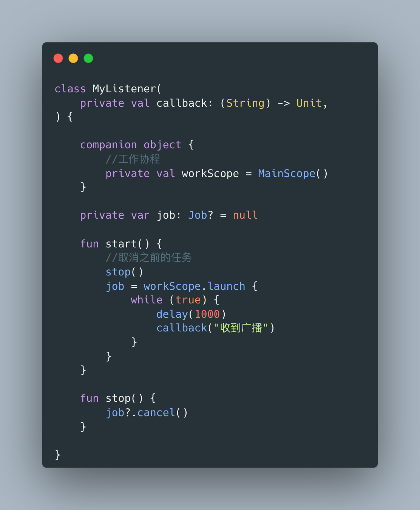

- 在`Activity`中的onCreate()阶段初始化监听，然后在onStart()中开启监听，在onStop()中关闭监听，这样的好处是当页面不可见的时候不会浪费手机性能。

  
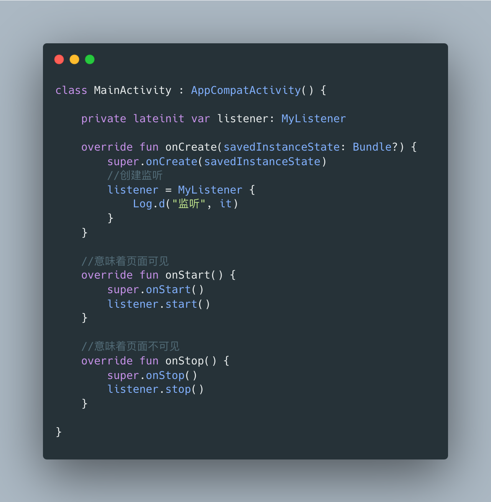

以上便是传统安卓开发中最直接也是最常见的一种根据生命周期来实现监听的方式，让我们分析一下这种方式的缺点：

1. **真实业务开发中，同一页面中往往存在大量的生命周期监听需求，`Activity`等生命周期组件会同时管理大量的组件，让代码难以维护。**
2. **代码缺乏一致性，需要监听生命周期的组件存在许多模板代码。试想一下，一个需要在onStart()启动，在onStop()关闭的、同时在项目中大量存在的组件，某天需要它在onResume()做一些操作，那将会导致灾难，因为需要每一处使用它的代码中增加onResume()的修改，一旦遗漏这个修改将会导致不可预知的bug。**
3. **无法获取实时的生命周期状态。假设在onStart()的阶段，需要执行一个网络请求或者其他耗时操作之后再调用`listener.start()`的场景下，无法保证此刻页面仍然处于可见的状态，开发者也无法获取「当前所处状态」来避免不可见的时候仍然调用`listener.start()`（这个缺陷上文已经提到，原生安卓生命周期只提供了生命周期事件而没有生命周期状态）。**

让我们看一看使用了「Lifecycle」库之后的生命周期是如何实现监听的：

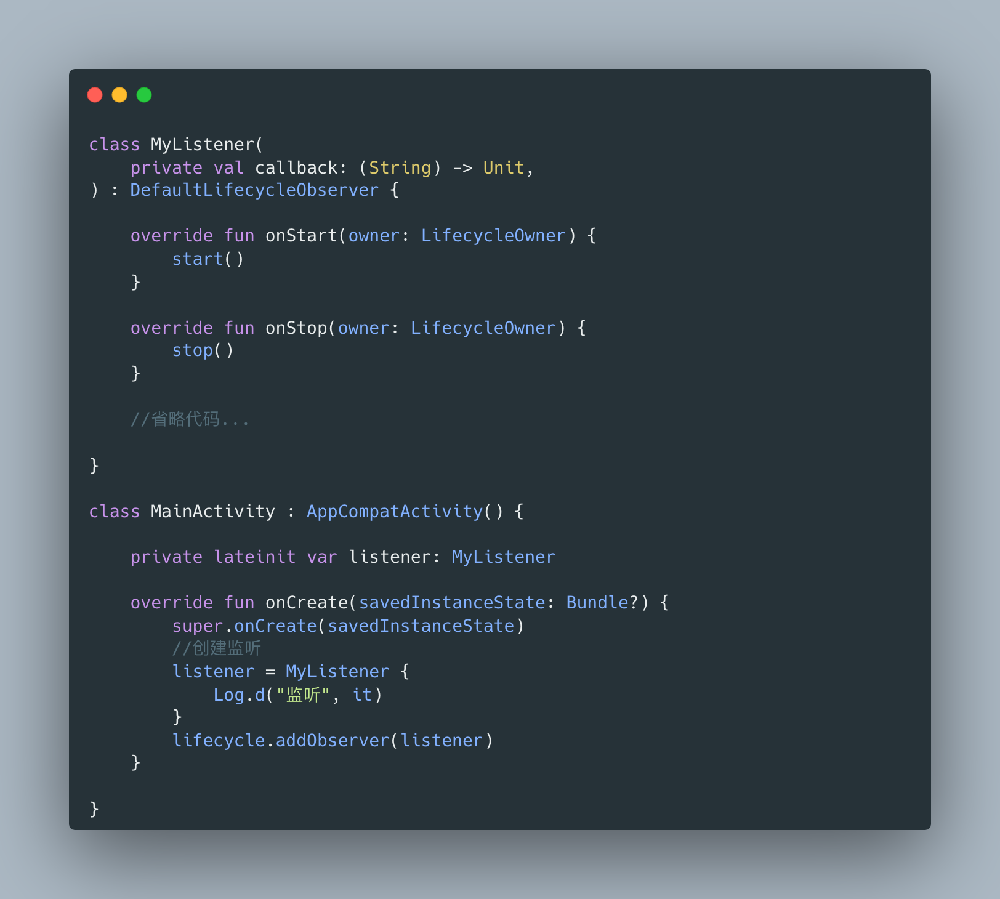

我们让需要监听`Activity`生命周期的`MyListener`组件实现`DefaultLifecycleObserver`接口，然后重写onStart()、onStop()方法，然后直接在`Activity`中获取`lifecycle`然后调用其`addObserver()`即可。

我们会发现，「生命周期管理」的责任从`Activity`转移到了组件中，`Activity`本身只负责对外广播自身的生命周期，这样极大减少了`Activity`的维护负担。

## 2.2、今生——详解篇

### 2.2.1、[Lifecycle](https://developer.android.google.cn/reference/androidx/lifecycle/Lifecycle)

** Lifecycle包含两个定义，一个指的是Jetpack库中的Lifecycle组件库，一个指的是Lifecycle组件库中的一个核心类，后文中如果没有特指情况下，文章中描述的默认为类*

上文中提到，安卓原生中只有描述生命周期的事件，缺乏一种描述当前生命周期所处的状态，但是「Lifecycle」库中补全了状态，下图中阐述了事件与状态的关系：

根据「Lifecycle」库的定义，一个生命周期状态的起点是「Initialized」，终点是「Destroyed」，当发生生命周期事件时，生命周期状态就会发生移动，包括**状态提升**和**状态下降**。

> 我们把状态从Initialized到Resumed当做一个从小到大的状态，如果状态值变小了，则称为**状态下降**，反之则为**状态提升**。

初步的定义有了，让我们把视角聚焦于`Lifecycle`类的源码：

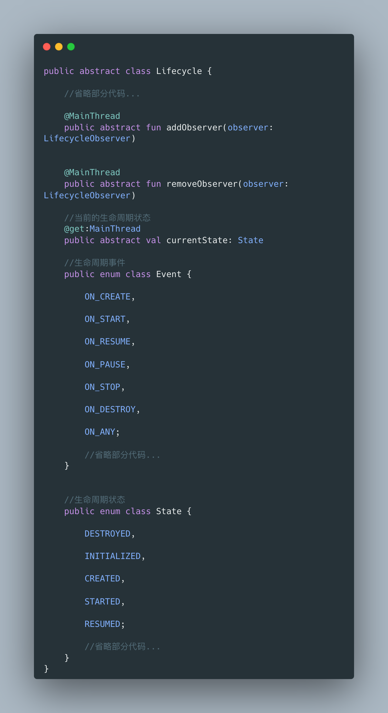

可以看到，`Lifecycle`类的设计基本遵循生命周期事件与状态图例，一个`Lifecycle`只有2个核心功能：

1. **缓存当前的生命周期状态（currentState）。**
2. **添加与移除生命周期观察者。**

上述代码中，对`Event`和`State`的部分代码进行了省略，下面展开讲解：

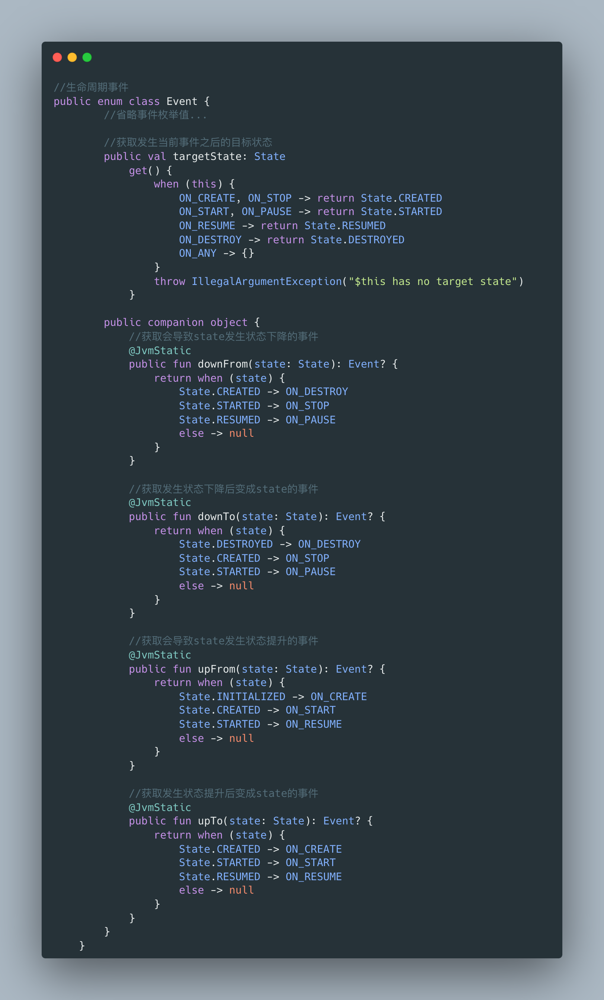

首先是`Event`类，`Event`类对应的是生命周期事件，也就是原生安卓生命周期的事件，即onCreate()、onPause()等。

该类提供了一个`targetState`的属性，指的是发生了该事件之后，生命周期状态发生改变的状态目标。

> 例如发生了ON_CREATE事件，这是状态从「Initialized」向「Created」转移的瞬间，那么targetState自然就是「State.CREATED」了；同理发生ON_STOP事件时，是状态从「Started」向「Created」转移的瞬间，targetState也是「State.CREATED」。
>
> 此处不必死记硬背，只需要配合**状态与事件图**理解其意义即可。

该类还提供了四个方法，downFrom()、downTo()、upFrom()、upTo()，这些都是当**状态发生提升或者降级的时候，方便获取对应的事件**的便捷方法，以downFrom()举例：

> downFrom(state:State)的含义是获取会导致state发生状态下降的事件，假如State.Created，发生什么事件会导致状态从State.Created下降呢，我们回去查看**状态与事件图**，发现是发生了ON_DESTROY事件，那么该方法就会返回ON_DESTROY。
>
> 此处不必死记硬背，只需要配合**状态与事件图**理解其意义即可。

看完了**Event**，我们把视角转向**State**：

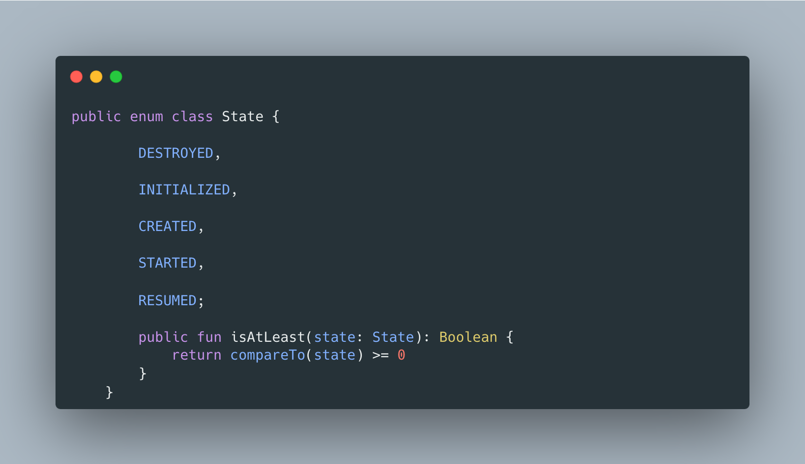

`State`的代码非常简单甚至不用一丝的省略，除了枚举值外仅有一个方法：**isAtLeast(state:State)**，此方法的含义是用于判断当前的状态是否大于或等于目标值的状态。

如何理解呢？还记得上文提到的吗，状态是有大小的：

> 我们把状态从Initialized到Resumed当做一个从小到大的状态，如果状态值变小了，则称为**状态下降**，反之则为**状态提升**。

因此对于生命周期的状态而言，Created是比Initialized**大**的，`isAtLeast(state:State)`的含义就是判断生命周期是否比某个预期值“走的更远”了，如果一个行为可以在组件创建后被执行，那么换句话说，只要生命周期的状态大于或者等于Created即可。

上文中提到，原生的生命周期回调无法实时获取生命周期所处的状态，一旦在生命周期回调方法中执行一些耗时操作，就无法耗时操作结束后，仍处于安全的生命周期区间，例如下面的代码：

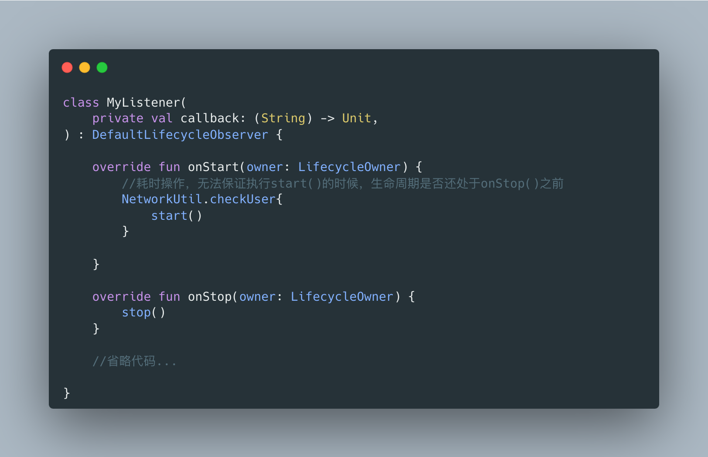

我们尝试在onStart()中执行一段耗时操作再开启监听，但是执行耗时操作期间无法`Activity`是否已经处于onStop()了，此刻我们就可以使用`isAtLeast(state:State)`来判断耗时操作结束后的生命周期状态：

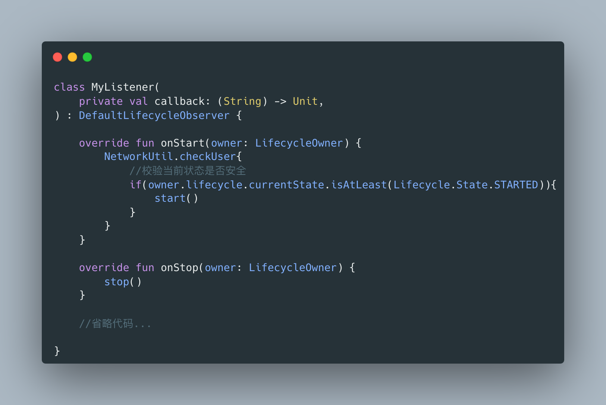

可见，「Lifecycle」库确实解决了生命周期只有事件没有状态的问题，开发者可以轻易获取当前的生命周期所处的阶段。

### 2.2.2、[LifecycleOwner](https://developer.android.google.cn/reference/androidx/lifecycle/LifecycleOwner)

首先，我们看看它的源码：

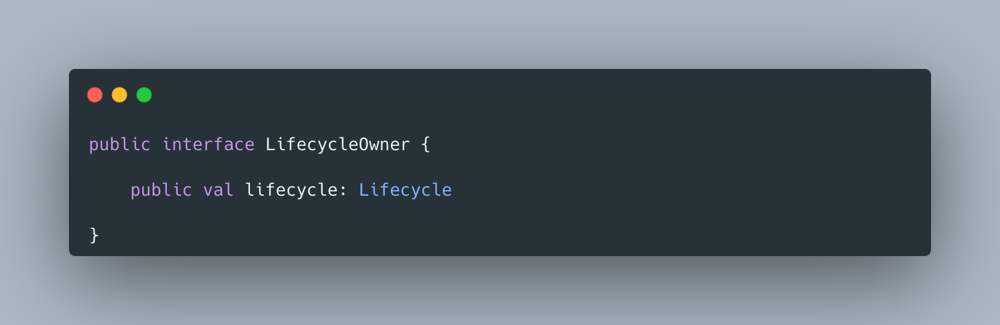

非常的简单，只是给实现者对外提供一个获取`Lifecycle`的入口，为什么要这样设计呢？还记得`Lifecycle`吗，它并不是一个接口而是一个抽象类，在Jvm中是单继承的，因此不太可能会让带有生命周期的组件直接继承`Lifecycle`抽象类。

因此在实际使用中，带有生命周期的组件和`Lifecycle`是包含的关系，即下图的情况：

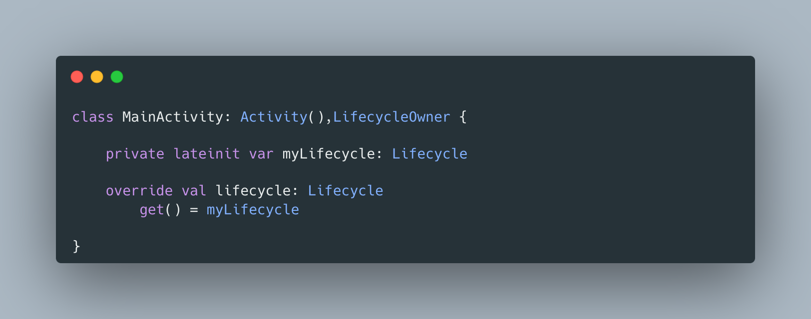

> 为什么谷歌的开发人员要如此奇怪呢，让`Lifecycle`变成接口，让Activity实现接口不一样能让组件访问到`Lifecycle`吗？先别急，`Lifecycle`的具体实现我们还没看，等到那一节将会解答这个疑问。

总结：`LifecycleOwner`只是一个简单的对外提供访问`Lifecycle`的接口。

### 2.2.3、[LifecycleObserver](https://developer.android.google.cn/reference/androidx/lifecycle/LifecycleObserver)

此处就不放代码了，因为这是一个空接口，作用是将其**实现者变成一个生命周期的观察者**。

其本身不起作用，业务中我们通常使用其子接口，例如`DefaultLifecycleObserver`、`LifecycleEventObserver`等，可以回去查看2.1节的`MyListener`实现了`DefaultLifecycleObserver`之后是如何感知`Activity`的生命周期的。

### 2.2.4、[LifecycleRegistry](https://developer.android.google.cn/reference/androidx/lifecycle/LifecycleRegistry)

此类是「Lifecycle」库的核心类，也是`Lifecycle`抽象类的直接实现，它的作用是**管理生命周期事件的派发**，但是其做了非常多的优化，例如解决了产生事件时，迭代观察者过程中可能会新增或者移除观察者，用ArrayList遍历会崩的问题、新加入的观察者如何派发事件的问题，移除观察者如何更新状态的问题等等。

这些谷歌的开发人员都帮我们解决了，只需要按下图简单配置一下即可使用：

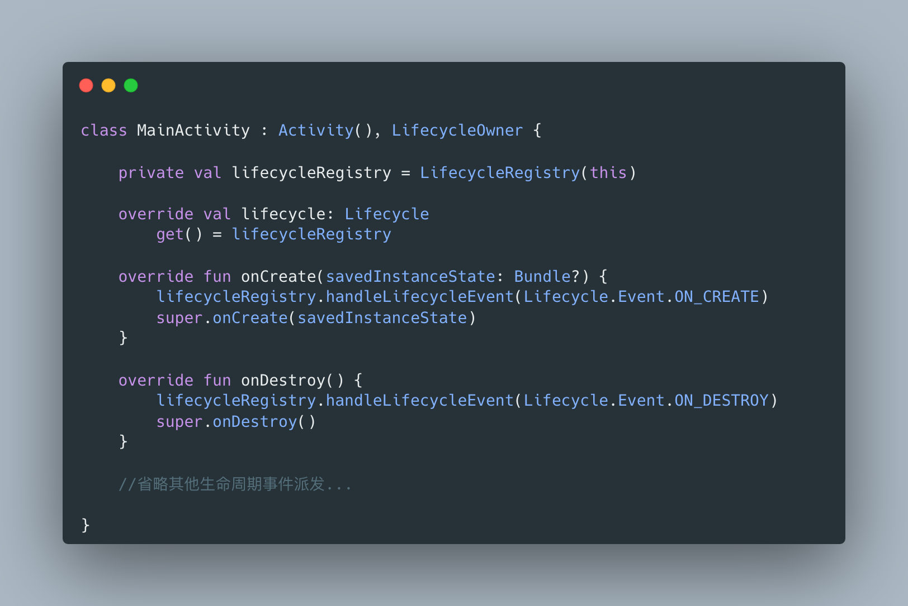

可见，我们只需要按照上文提到的结构，在`Activity`中实例化一个`LifecycleRegistry`，然后在合适的生命周期回调中派发响应的事件，所有监听当前`Activity`生命周期的组件就可以获取到当前`Activity`的生命周期了。

下面即将深入`LifecycleRegistry`的源码层面探究一下它的原理，但是需要注意的是，本文章的目的并不是让读者100%搞懂源码中每一行代码的运行逻辑，因为这违背了本系列文章的初衷——让读者能够在对库有足够充足的了解下开发，同时笔者也没有100%搞懂源码每一行的逻辑。

如果读者非常有钻研精神，可以看一下这个博主的文章，他对`LifecycleRegistry`的源码做了非常详细的讲解：[【Jetpack】学穿：Lifecycle → 生命周期 (原理篇) - 掘金 (juejin.cn)](https://juejin.cn/post/7071144317636575262?searchId=20231009151913294FEF5A47C68C20DD18#heading-9)

